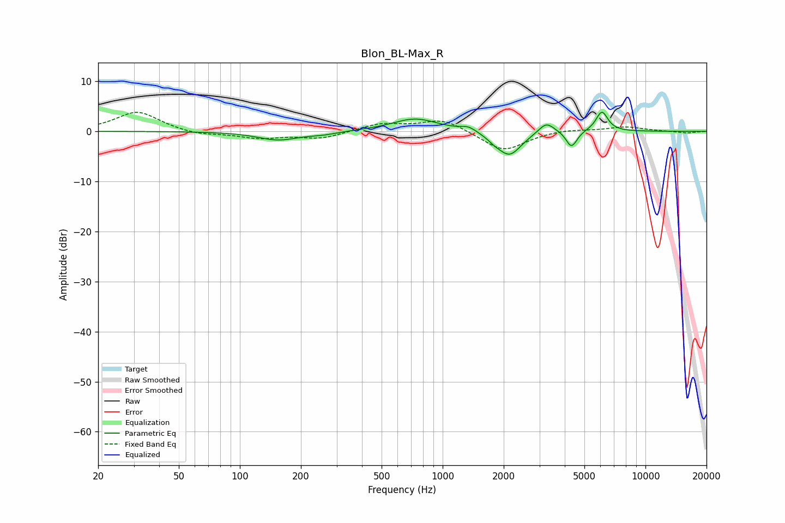

# Blon_BL-Max_R
See [usage instructions](https://github.com/jaakkopasanen/AutoEq#usage) for more options and info.

### Parametric EQs
Apply preamp of -3.9 dB when using parametric equalizer.

|   # | Type    |   Fc (Hz) |    Q |   Gain (dB) |
|-----|---------|-----------|------|-------------|
|   1 | Peaking |       154 | 1.39 |        -1.7 |
|   2 | Peaking |       257 | 2.06 |        -0.5 |
|   3 | Peaking |       732 | 1.25 |         2.6 |
|   4 | Peaking |      1340 | 3.72 |         1   |
|   5 | Peaking |      1798 | 4.35 |        -0.7 |
|   6 | Peaking |      2135 | 2.39 |        -4.8 |
|   7 | Peaking |      3244 | 3.66 |         2.3 |
|   8 | Peaking |      4282 | 5.77 |        -2.7 |
|   9 | Peaking |      4494 | 6    |        -0.7 |
|  10 | Peaking |      6099 | 4.66 |         4   |

### Fixed Band EQs
When using fixed band (also called graphic) equalizer, apply preamp of **-3.9 dB** (if available) and set gains manually with these parameters.

|   # | Type    |   Fc (Hz) |    Q |   Gain (dB) |
|-----|---------|-----------|------|-------------|
|   1 | Peaking |        31 | 1.41 |         4   |
|   2 | Peaking |        62 | 1.41 |        -0.8 |
|   3 | Peaking |       125 | 1.41 |        -1.3 |
|   4 | Peaking |       250 | 1.41 |        -1.4 |
|   5 | Peaking |       500 | 1.41 |         1.5 |
|   6 | Peaking |      1000 | 1.41 |         2.5 |
|   7 | Peaking |      2000 | 1.41 |        -4.1 |
|   8 | Peaking |      4000 | 1.41 |         0.5 |
|   9 | Peaking |      8000 | 1.41 |         0.9 |
|  10 | Peaking |     16000 | 1.41 |        -0.4 |

### Graphs

