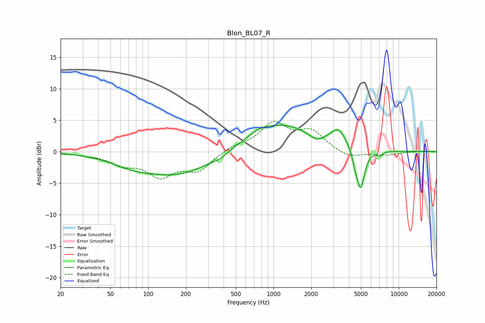

# Blon_BL07_R
See [usage instructions](https://github.com/jaakkopasanen/AutoEq#usage) for more options and info.

### Parametric EQs
Apply preamp of -4.3 dB when using parametric equalizer.

|   # | Type    |   Fc (Hz) |    Q |   Gain (dB) |
|-----|---------|-----------|------|-------------|
|   1 | Peaking |        72 | 1.01 |        -0.8 |
|   2 | Peaking |       171 | 0.44 |        -3.8 |
|   3 | Peaking |       375 | 3.12 |        -0.4 |
|   4 | Peaking |       750 | 2.48 |         0.4 |
|   5 | Peaking |      1075 | 0.51 |         4.6 |
|   6 | Peaking |      2202 | 2.63 |        -1   |
|   7 | Peaking |      3311 | 2.35 |         2.6 |
|   8 | Peaking |      4511 | 6    |        -1.4 |
|   9 | Peaking |      4967 | 4.4  |        -6.3 |
|  10 | Peaking |      7059 | 6    |        -0.7 |

### Fixed Band EQs
When using fixed band (also called graphic) equalizer, apply preamp of **-4.9 dB** (if available) and set gains manually with these parameters.

|   # | Type    |   Fc (Hz) |    Q |   Gain (dB) |
|-----|---------|-----------|------|-------------|
|   1 | Peaking |        31 | 1.41 |        -0.3 |
|   2 | Peaking |        62 | 1.41 |        -1.7 |
|   3 | Peaking |       125 | 1.41 |        -3.6 |
|   4 | Peaking |       250 | 1.41 |        -2.8 |
|   5 | Peaking |       500 | 1.41 |         0.8 |
|   6 | Peaking |      1000 | 1.41 |         4.2 |
|   7 | Peaking |      2000 | 1.41 |         3   |
|   8 | Peaking |      4000 | 1.41 |        -1.1 |
|   9 | Peaking |      8000 | 1.41 |        -0.5 |
|  10 | Peaking |     16000 | 1.41 |         0.1 |

### Graphs

