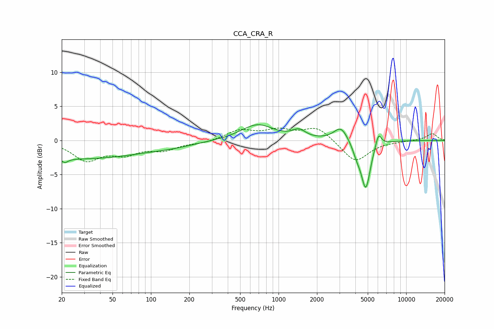

# CCA_CRA_R
See [usage instructions](https://github.com/jaakkopasanen/AutoEq#usage) for more options and info.

### Parametric EQs
Apply preamp of -2.4 dB when using parametric equalizer.

|   # | Type    |   Fc (Hz) |    Q |   Gain (dB) |
|-----|---------|-----------|------|-------------|
|   1 | Peaking |        21 | 5.95 |        -2.8 |
|   2 | Peaking |        21 | 6    |         2.2 |
|   3 | Peaking |        27 | 0.26 |        -2.7 |
|   4 | Peaking |       150 | 0.81 |        -0.4 |
|   5 | Peaking |       682 | 1.1  |         2.3 |
|   6 | Peaking |      1446 | 2.82 |         1.1 |
|   7 | Peaking |      3081 | 2.59 |         2.1 |
|   8 | Peaking |      4109 | 4.13 |        -1.4 |
|   9 | Peaking |      4828 | 3.85 |        -6.9 |
|  10 | Peaking |      6071 | 6    |         2   |

### Fixed Band EQs
When using fixed band (also called graphic) equalizer, apply preamp of **-1.9 dB** (if available) and set gains manually with these parameters.

|   # | Type    |   Fc (Hz) |    Q |   Gain (dB) |
|-----|---------|-----------|------|-------------|
|   1 | Peaking |        31 | 1.41 |        -2.8 |
|   2 | Peaking |        62 | 1.41 |        -1.7 |
|   3 | Peaking |       125 | 1.41 |        -1.2 |
|   4 | Peaking |       250 | 1.41 |        -0.4 |
|   5 | Peaking |       500 | 1.41 |         1.4 |
|   6 | Peaking |      1000 | 1.41 |         1.3 |
|   7 | Peaking |      2000 | 1.41 |         2   |
|   8 | Peaking |      4000 | 1.41 |        -3.2 |
|   9 | Peaking |      8000 | 1.41 |        -0.1 |
|  10 | Peaking |     16000 | 1.41 |         1   |

### Graphs

