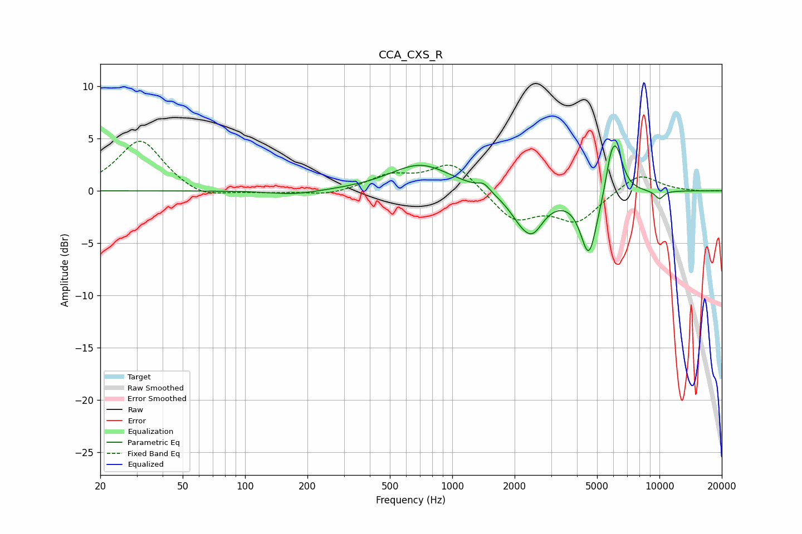

# CCA_CXS_R
See [usage instructions](https://github.com/jaakkopasanen/AutoEq#usage) for more options and info.

### Parametric EQs
Apply preamp of -4.4 dB when using parametric equalizer.

|   # | Type    |   Fc (Hz) |    Q |   Gain (dB) |
|-----|---------|-----------|------|-------------|
|   1 | Peaking |       174 | 1.16 |        -0.4 |
|   2 | Peaking |       703 | 0.96 |         2.6 |
|   3 | Peaking |      1421 | 5.02 |         0.7 |
|   4 | Peaking |      2287 | 3.44 |         0.8 |
|   5 | Peaking |      2291 | 2.12 |        -4   |
|   6 | Peaking |      2462 | 3.08 |        -1   |
|   7 | Peaking |      4567 | 3.45 |        -6.1 |
|   8 | Peaking |      5801 | 5.97 |         1.8 |
|   9 | Peaking |      6172 | 3.97 |         4.3 |
|  10 | Peaking |     10000 | 5.54 |        -0.8 |

### Fixed Band EQs
When using fixed band (also called graphic) equalizer, apply preamp of **-4.8 dB** (if available) and set gains manually with these parameters.

|   # | Type    |   Fc (Hz) |    Q |   Gain (dB) |
|-----|---------|-----------|------|-------------|
|   1 | Peaking |        31 | 1.41 |         4.9 |
|   2 | Peaking |        62 | 1.41 |        -0.9 |
|   3 | Peaking |       125 | 1.41 |        -0.2 |
|   4 | Peaking |       250 | 1.41 |        -0.5 |
|   5 | Peaking |       500 | 1.41 |         1.4 |
|   6 | Peaking |      1000 | 1.41 |         2.8 |
|   7 | Peaking |      2000 | 1.41 |        -2.8 |
|   8 | Peaking |      4000 | 1.41 |        -2.8 |
|   9 | Peaking |      8000 | 1.41 |         1.8 |
|  10 | Peaking |     16000 | 1.41 |        -0.1 |

### Graphs

