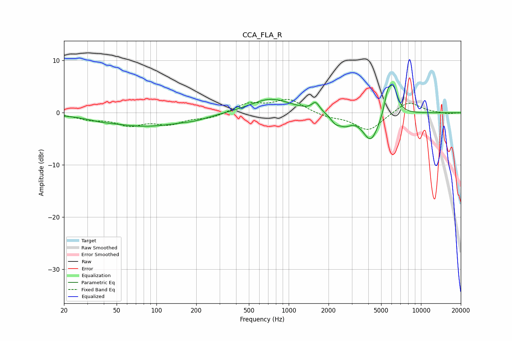

# CCA_FLA_R
See [usage instructions](https://github.com/jaakkopasanen/AutoEq#usage) for more options and info.

### Parametric EQs
Apply preamp of -5.3 dB when using parametric equalizer.

|   # | Type    |   Fc (Hz) |    Q |   Gain (dB) |
|-----|---------|-----------|------|-------------|
|   1 | Peaking |        38 | 1.87 |        -0.3 |
|   2 | Peaking |        82 | 0.47 |        -2.5 |
|   3 | Peaking |       196 | 1.44 |        -0.5 |
|   4 | Peaking |       731 | 0.92 |         2.8 |
|   5 | Peaking |      1598 | 5    |         1.7 |
|   6 | Peaking |      2261 | 3.78 |        -1.5 |
|   7 | Peaking |      2675 | 3.12 |        -1.6 |
|   8 | Peaking |      4174 | 2.28 |        -5.5 |
|   9 | Peaking |      5599 | 5.48 |         3.5 |
|  10 | Peaking |      6180 | 4    |         4.8 |

### Fixed Band EQs
When using fixed band (also called graphic) equalizer, apply preamp of **-2.7 dB** (if available) and set gains manually with these parameters.

|   # | Type    |   Fc (Hz) |    Q |   Gain (dB) |
|-----|---------|-----------|------|-------------|
|   1 | Peaking |        31 | 1.41 |        -1.1 |
|   2 | Peaking |        62 | 1.41 |        -2.1 |
|   3 | Peaking |       125 | 1.41 |        -1.9 |
|   4 | Peaking |       250 | 1.41 |        -0.9 |
|   5 | Peaking |       500 | 1.41 |         1.7 |
|   6 | Peaking |      1000 | 1.41 |         2.5 |
|   7 | Peaking |      2000 | 1.41 |        -0.8 |
|   8 | Peaking |      4000 | 1.41 |        -3.5 |
|   9 | Peaking |      8000 | 1.41 |         2.3 |
|  10 | Peaking |     16000 | 1.41 |        -0.2 |

### Graphs

