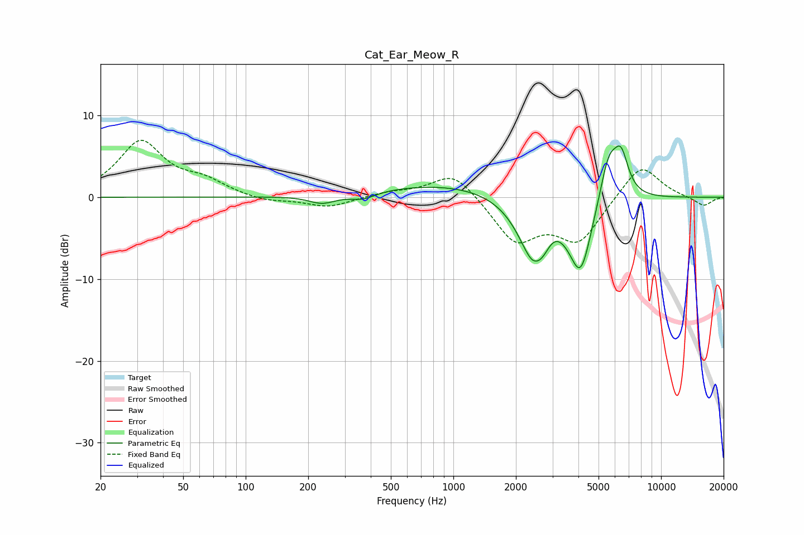

# Cat_Ear_Meow_R
See [usage instructions](https://github.com/jaakkopasanen/AutoEq#usage) for more options and info.

### Parametric EQs
Apply preamp of -6.4 dB when using parametric equalizer.

|   # | Type    |   Fc (Hz) |    Q |   Gain (dB) |
|-----|---------|-----------|------|-------------|
|   1 | Peaking |       234 | 2.15 |        -1   |
|   2 | Peaking |       369 | 2.38 |        -0.8 |
|   3 | Peaking |      1002 | 0.41 |         1.7 |
|   4 | Peaking |      2474 | 1.59 |        -6.1 |
|   5 | Peaking |      2530 | 2.72 |        -3.5 |
|   6 | Peaking |      2536 | 4.44 |         1.1 |
|   7 | Peaking |      3016 | 2.93 |         1.5 |
|   8 | Peaking |      4099 | 2.47 |        -8.9 |
|   9 | Peaking |      5595 | 3    |         5.9 |
|  10 | Peaking |      6427 | 3.89 |         4.5 |

### Fixed Band EQs
When using fixed band (also called graphic) equalizer, apply preamp of **-7.0 dB** (if available) and set gains manually with these parameters.

|   # | Type    |   Fc (Hz) |    Q |   Gain (dB) |
|-----|---------|-----------|------|-------------|
|   1 | Peaking |        31 | 1.41 |         6.7 |
|   2 | Peaking |        62 | 1.41 |         1.7 |
|   3 | Peaking |       125 | 1.41 |        -0.6 |
|   4 | Peaking |       250 | 1.41 |        -1.2 |
|   5 | Peaking |       500 | 1.41 |         0.6 |
|   6 | Peaking |      1000 | 1.41 |         3.3 |
|   7 | Peaking |      2000 | 1.41 |        -5.3 |
|   8 | Peaking |      4000 | 1.41 |        -5.2 |
|   9 | Peaking |      8000 | 1.41 |         4.3 |
|  10 | Peaking |     16000 | 1.41 |        -1.1 |

### Graphs

