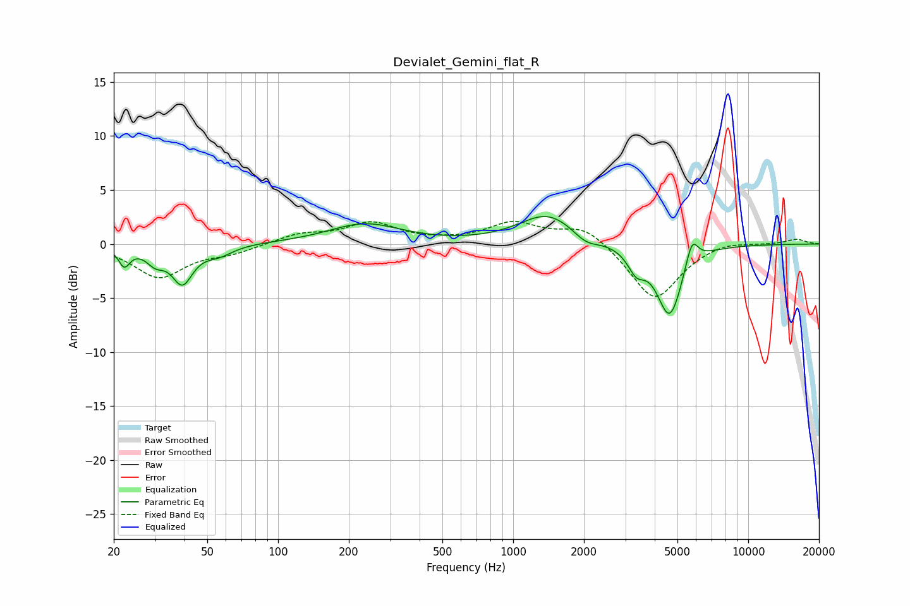

# Devialet_Gemini_flat_R
See [usage instructions](https://github.com/jaakkopasanen/AutoEq#usage) for more options and info.

### Parametric EQs
Apply preamp of -2.6 dB when using parametric equalizer.

|   # | Type    |   Fc (Hz) |    Q |   Gain (dB) |
|-----|---------|-----------|------|-------------|
|   1 | Peaking |        22 | 5.95 |        -1.7 |
|   2 | Peaking |        30 | 3.62 |        -1.3 |
|   3 | Peaking |        39 | 3.24 |        -3.4 |
|   4 | Peaking |        56 | 2.37 |        -0.8 |
|   5 | Peaking |       234 | 0.93 |         1.8 |
|   6 | Peaking |      1407 | 1.16 |         2.8 |
|   7 | Peaking |      2040 | 2.58 |        -0.9 |
|   8 | Peaking |      3342 | 3.83 |        -1.9 |
|   9 | Peaking |      4633 | 2.55 |        -6.7 |
|  10 | Peaking |      5761 | 5.24 |         2.5 |

### Fixed Band EQs
When using fixed band (also called graphic) equalizer, apply preamp of **-2.2 dB** (if available) and set gains manually with these parameters.

|   # | Type    |   Fc (Hz) |    Q |   Gain (dB) |
|-----|---------|-----------|------|-------------|
|   1 | Peaking |        31 | 1.41 |        -3   |
|   2 | Peaking |        62 | 1.41 |        -0.7 |
|   3 | Peaking |       125 | 1.41 |         0.9 |
|   4 | Peaking |       250 | 1.41 |         1.9 |
|   5 | Peaking |       500 | 1.41 |         0.1 |
|   6 | Peaking |      1000 | 1.41 |         1.9 |
|   7 | Peaking |      2000 | 1.41 |         1.7 |
|   8 | Peaking |      4000 | 1.41 |        -5.3 |
|   9 | Peaking |      8000 | 1.41 |         0.4 |
|  10 | Peaking |     16000 | 1.41 |         0.5 |

### Graphs

