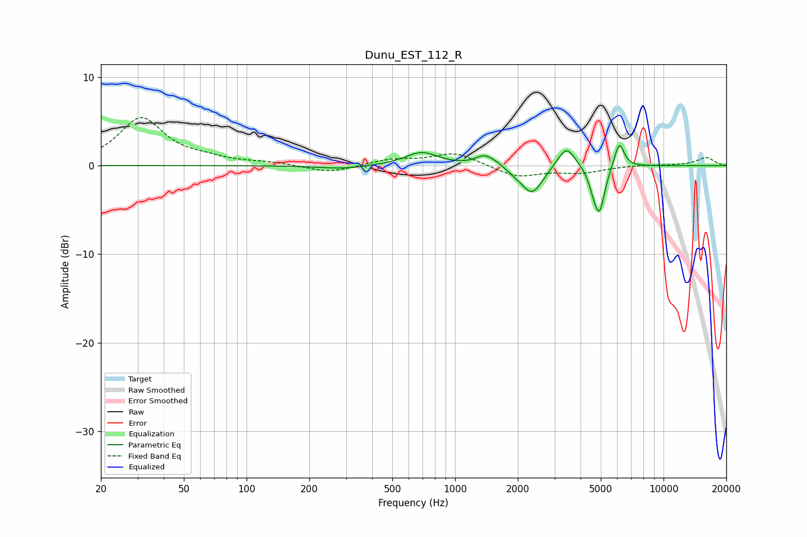

# Dunu_EST_112_R
See [usage instructions](https://github.com/jaakkopasanen/AutoEq#usage) for more options and info.

### Parametric EQs
Apply preamp of -2.3 dB when using parametric equalizer.

|   # | Type    |   Fc (Hz) |    Q |   Gain (dB) |
|-----|---------|-----------|------|-------------|
|   1 | Peaking |       287 | 1.26 |        -0.4 |
|   2 | Peaking |       690 | 1.8  |         1.5 |
|   3 | Peaking |      1381 | 3.3  |         1.1 |
|   4 | Peaking |      1587 | 3.8  |         0.4 |
|   5 | Peaking |      2046 | 2.29 |        -0.7 |
|   6 | Peaking |      2363 | 2.92 |        -2.8 |
|   7 | Peaking |      3420 | 3.36 |         2.5 |
|   8 | Peaking |      4600 | 6    |        -1.3 |
|   9 | Peaking |      4931 | 5.48 |        -4.9 |
|  10 | Peaking |      6133 | 6    |         2.9 |

### Fixed Band EQs
When using fixed band (also called graphic) equalizer, apply preamp of **-5.5 dB** (if available) and set gains manually with these parameters.

|   # | Type    |   Fc (Hz) |    Q |   Gain (dB) |
|-----|---------|-----------|------|-------------|
|   1 | Peaking |        31 | 1.41 |         5.3 |
|   2 | Peaking |        62 | 1.41 |         0.6 |
|   3 | Peaking |       125 | 1.41 |         0.3 |
|   4 | Peaking |       250 | 1.41 |        -0.8 |
|   5 | Peaking |       500 | 1.41 |         0.7 |
|   6 | Peaking |      1000 | 1.41 |         1.4 |
|   7 | Peaking |      2000 | 1.41 |        -1.3 |
|   8 | Peaking |      4000 | 1.41 |        -0.7 |
|   9 | Peaking |      8000 | 1.41 |         0.1 |
|  10 | Peaking |     16000 | 1.41 |         0.9 |

### Graphs

