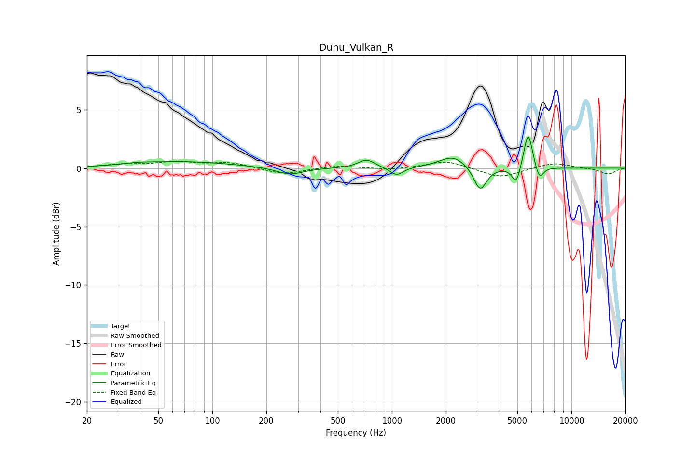

# Dunu_Vulkan_R
See [usage instructions](https://github.com/jaakkopasanen/AutoEq#usage) for more options and info.

### Parametric EQs
Apply preamp of -2.8 dB when using parametric equalizer.

|   # | Type    |   Fc (Hz) |    Q |   Gain (dB) |
|-----|---------|-----------|------|-------------|
|   1 | Peaking |        39 | 1.84 |         0.1 |
|   2 | Peaking |        70 | 0.52 |         0.6 |
|   3 | Peaking |       270 | 1.86 |        -0.6 |
|   4 | Peaking |       722 | 3.11 |         0.7 |
|   5 | Peaking |      1062 | 3.86 |        -0.7 |
|   6 | Peaking |      2194 | 1.87 |         1.1 |
|   7 | Peaking |      3100 | 3.99 |        -2.1 |
|   8 | Peaking |      4928 | 6    |        -1.5 |
|   9 | Peaking |      5740 | 5.81 |         3.3 |
|  10 | Peaking |      6630 | 6    |        -1.2 |

### Fixed Band EQs
When using fixed band (also called graphic) equalizer, apply preamp of **-0.7 dB** (if available) and set gains manually with these parameters.

|   # | Type    |   Fc (Hz) |    Q |   Gain (dB) |
|-----|---------|-----------|------|-------------|
|   1 | Peaking |        31 | 1.41 |         0.3 |
|   2 | Peaking |        62 | 1.41 |         0.5 |
|   3 | Peaking |       125 | 1.41 |         0.5 |
|   4 | Peaking |       250 | 1.41 |        -0.5 |
|   5 | Peaking |       500 | 1.41 |         0.2 |
|   6 | Peaking |      1000 | 1.41 |        -0.2 |
|   7 | Peaking |      2000 | 1.41 |         0.7 |
|   8 | Peaking |      4000 | 1.41 |        -0.8 |
|   9 | Peaking |      8000 | 1.41 |         0.5 |
|  10 | Peaking |     16000 | 1.41 |        -0.5 |

### Graphs

