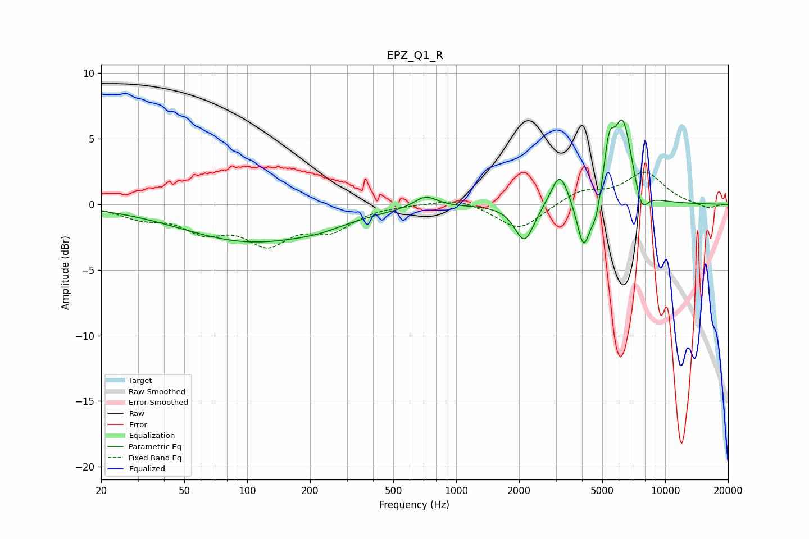

# EPZ_Q1_R
See [usage instructions](https://github.com/jaakkopasanen/AutoEq#usage) for more options and info.

### Parametric EQs
Apply preamp of -6.5 dB when using parametric equalizer.

|   # | Type    |   Fc (Hz) |    Q |   Gain (dB) |
|-----|---------|-----------|------|-------------|
|   1 | Peaking |       106 | 0.42 |        -2.8 |
|   2 | Peaking |       222 | 1.29 |        -0.3 |
|   3 | Peaking |       713 | 2.58 |         0.9 |
|   4 | Peaking |      2121 | 3.07 |        -2.9 |
|   5 | Peaking |      3131 | 3.44 |         2.6 |
|   6 | Peaking |      4069 | 4.48 |        -3.8 |
|   7 | Peaking |      4670 | 5.62 |        -1.7 |
|   8 | Peaking |      5383 | 5.76 |         3.3 |
|   9 | Peaking |      6270 | 3.01 |         6.3 |
|  10 | Peaking |      7694 | 4.28 |        -1.9 |

### Fixed Band EQs
When using fixed band (also called graphic) equalizer, apply preamp of **-2.5 dB** (if available) and set gains manually with these parameters.

|   # | Type    |   Fc (Hz) |    Q |   Gain (dB) |
|-----|---------|-----------|------|-------------|
|   1 | Peaking |        31 | 1.41 |        -0.9 |
|   2 | Peaking |        62 | 1.41 |        -1.8 |
|   3 | Peaking |       125 | 1.41 |        -2.7 |
|   4 | Peaking |       250 | 1.41 |        -1.7 |
|   5 | Peaking |       500 | 1.41 |         0   |
|   6 | Peaking |      1000 | 1.41 |         0.6 |
|   7 | Peaking |      2000 | 1.41 |        -2   |
|   8 | Peaking |      4000 | 1.41 |         1   |
|   9 | Peaking |      8000 | 1.41 |         2.4 |
|  10 | Peaking |     16000 | 1.41 |        -0.4 |

### Graphs

