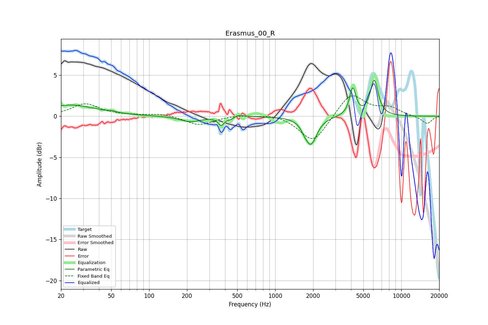

# Erasmus_00_R
See [usage instructions](https://github.com/jaakkopasanen/AutoEq#usage) for more options and info.

### Parametric EQs
Apply preamp of -4.5 dB when using parametric equalizer.

|   # | Type    |   Fc (Hz) |    Q |   Gain (dB) |
|-----|---------|-----------|------|-------------|
|   1 | Peaking |        24 | 0.72 |         1.4 |
|   2 | Peaking |        51 | 5    |         0.1 |
|   3 | Peaking |       213 | 1.77 |        -0.7 |
|   4 | Peaking |       373 | 6    |        -1   |
|   5 | Peaking |       454 | 3.94 |        -0.5 |
|   6 | Peaking |       491 | 3.23 |         0.5 |
|   7 | Peaking |      1708 | 5.41 |        -0.4 |
|   8 | Peaking |      1921 | 3.1  |        -3.3 |
|   9 | Peaking |      4125 | 5.72 |         3.3 |
|  10 | Peaking |      6106 | 4.48 |         4.3 |

### Fixed Band EQs
When using fixed band (also called graphic) equalizer, apply preamp of **-2.6 dB** (if available) and set gains manually with these parameters.

|   # | Type    |   Fc (Hz) |    Q |   Gain (dB) |
|-----|---------|-----------|------|-------------|
|   1 | Peaking |        31 | 1.41 |         1.5 |
|   2 | Peaking |        62 | 1.41 |         0.1 |
|   3 | Peaking |       125 | 1.41 |         0.3 |
|   4 | Peaking |       250 | 1.41 |        -1.1 |
|   5 | Peaking |       500 | 1.41 |         0.2 |
|   6 | Peaking |      1000 | 1.41 |         0.3 |
|   7 | Peaking |      2000 | 1.41 |        -3.3 |
|   8 | Peaking |      4000 | 1.41 |         2.9 |
|   9 | Peaking |      8000 | 1.41 |         1   |
|  10 | Peaking |     16000 | 1.41 |        -0.9 |

### Graphs

