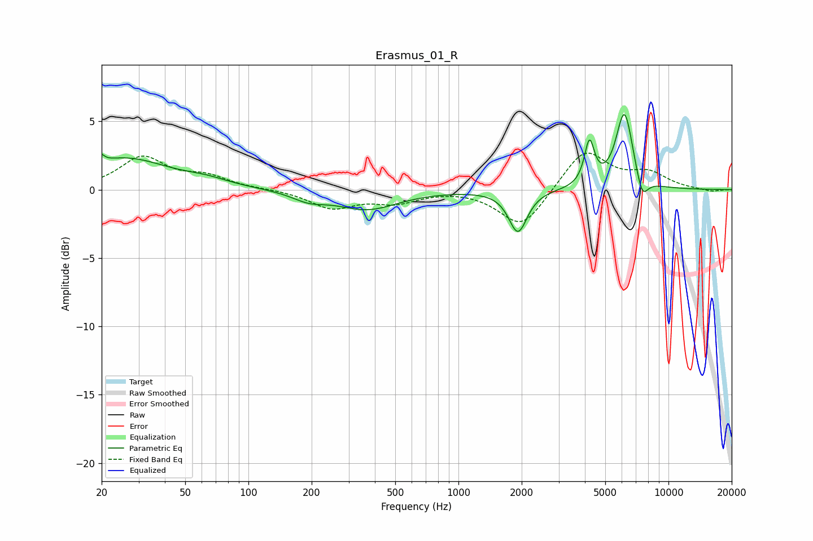

# Erasmus_01_R
See [usage instructions](https://github.com/jaakkopasanen/AutoEq#usage) for more options and info.

### Parametric EQs
Apply preamp of -5.6 dB when using parametric equalizer.

|   # | Type    |   Fc (Hz) |    Q |   Gain (dB) |
|-----|---------|-----------|------|-------------|
|   1 | Peaking |        20 | 5.98 |         2.3 |
|   2 | Peaking |        20 | 5.97 |        -1.7 |
|   3 | Peaking |        26 | 0.7  |         2.2 |
|   4 | Peaking |        63 | 1.29 |         0.4 |
|   5 | Peaking |       194 | 1.8  |        -0.6 |
|   6 | Peaking |       367 | 0.96 |        -1.4 |
|   7 | Peaking |      1920 | 3.27 |        -3.1 |
|   8 | Peaking |      4204 | 6    |         3.2 |
|   9 | Peaking |      6172 | 3.39 |         5.7 |
|  10 | Peaking |      7491 | 4.77 |        -1.7 |

### Fixed Band EQs
When using fixed band (also called graphic) equalizer, apply preamp of **-2.8 dB** (if available) and set gains manually with these parameters.

|   # | Type    |   Fc (Hz) |    Q |   Gain (dB) |
|-----|---------|-----------|------|-------------|
|   1 | Peaking |        31 | 1.41 |         2.3 |
|   2 | Peaking |        62 | 1.41 |         0.9 |
|   3 | Peaking |       125 | 1.41 |         0   |
|   4 | Peaking |       250 | 1.41 |        -1.3 |
|   5 | Peaking |       500 | 1.41 |        -0.8 |
|   6 | Peaking |      1000 | 1.41 |         0.1 |
|   7 | Peaking |      2000 | 1.41 |        -2.8 |
|   8 | Peaking |      4000 | 1.41 |         3   |
|   9 | Peaking |      8000 | 1.41 |         1.1 |
|  10 | Peaking |     16000 | 1.41 |        -0.2 |

### Graphs

