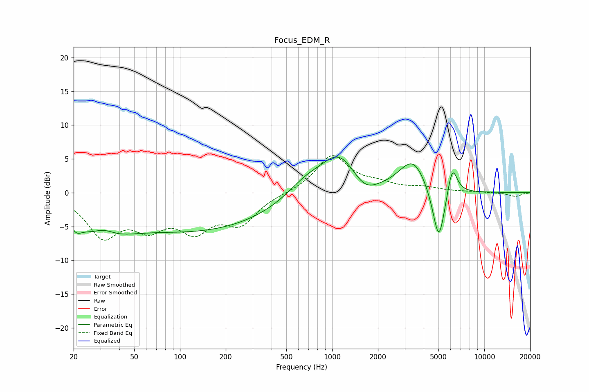

# Focus_EDM_R
See [usage instructions](https://github.com/jaakkopasanen/AutoEq#usage) for more options and info.

### Parametric EQs
Apply preamp of -5.4 dB when using parametric equalizer.

|   # | Type    |   Fc (Hz) |    Q |   Gain (dB) |
|-----|---------|-----------|------|-------------|
|   1 | Peaking |        21 | 4.24 |        -1.3 |
|   2 | Peaking |        29 | 0.8  |        -5.2 |
|   3 | Peaking |        31 | 1.81 |         2   |
|   4 | Peaking |       136 | 0.28 |        -5.4 |
|   5 | Peaking |       672 | 1.09 |         2.4 |
|   6 | Peaking |      1114 | 1.19 |         5.6 |
|   7 | Peaking |      1635 | 1.7  |        -2.1 |
|   8 | Peaking |      3405 | 1.54 |         4.9 |
|   9 | Peaking |      5027 | 3.32 |        -8.7 |
|  10 | Peaking |      6156 | 4.17 |         4.6 |

### Fixed Band EQs
When using fixed band (also called graphic) equalizer, apply preamp of **-5.6 dB** (if available) and set gains manually with these parameters.

|   # | Type    |   Fc (Hz) |    Q |   Gain (dB) |
|-----|---------|-----------|------|-------------|
|   1 | Peaking |        31 | 1.41 |        -6   |
|   2 | Peaking |        62 | 1.41 |        -4.2 |
|   3 | Peaking |       125 | 1.41 |        -4.8 |
|   4 | Peaking |       250 | 1.41 |        -4.1 |
|   5 | Peaking |       500 | 1.41 |        -0.1 |
|   6 | Peaking |      1000 | 1.41 |         5.5 |
|   7 | Peaking |      2000 | 1.41 |         1   |
|   8 | Peaking |      4000 | 1.41 |         0.6 |
|   9 | Peaking |      8000 | 1.41 |         0.1 |
|  10 | Peaking |     16000 | 1.41 |        -0.6 |

### Graphs

