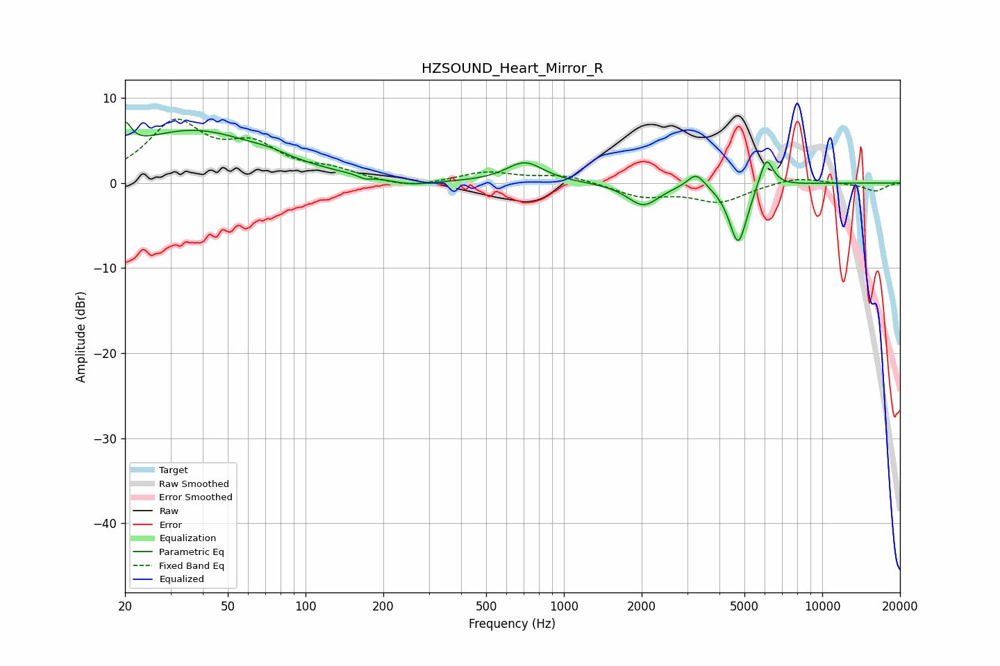

# HZSOUND_Heart_Mirror_R
See [usage instructions](https://github.com/jaakkopasanen/AutoEq#usage) for more options and info.

### Parametric EQs
Apply preamp of -7.2 dB when using parametric equalizer.

|   # | Type    |   Fc (Hz) |    Q |   Gain (dB) |
|-----|---------|-----------|------|-------------|
|   1 | Peaking |        20 | 5.98 |         2.9 |
|   2 | Peaking |        37 | 0.52 |         6.1 |
|   3 | Peaking |        73 | 1.99 |         0.4 |
|   4 | Peaking |       170 | 5.99 |        -0.4 |
|   5 | Peaking |       255 | 1.62 |        -0.6 |
|   6 | Peaking |       706 | 1.95 |         2.4 |
|   7 | Peaking |      2028 | 2.32 |        -2.6 |
|   8 | Peaking |      3249 | 4.22 |         1.8 |
|   9 | Peaking |      4730 | 3.96 |        -7.2 |
|  10 | Peaking |      6072 | 5.07 |         3.7 |

### Fixed Band EQs
When using fixed band (also called graphic) equalizer, apply preamp of **-7.6 dB** (if available) and set gains manually with these parameters.

|   # | Type    |   Fc (Hz) |    Q |   Gain (dB) |
|-----|---------|-----------|------|-------------|
|   1 | Peaking |        31 | 1.41 |         6.8 |
|   2 | Peaking |        62 | 1.41 |         3.7 |
|   3 | Peaking |       125 | 1.41 |         1.2 |
|   4 | Peaking |       250 | 1.41 |        -0.7 |
|   5 | Peaking |       500 | 1.41 |         1.2 |
|   6 | Peaking |      1000 | 1.41 |         0.9 |
|   7 | Peaking |      2000 | 1.41 |        -1.5 |
|   8 | Peaking |      4000 | 1.41 |        -2.1 |
|   9 | Peaking |      8000 | 1.41 |         0.8 |
|  10 | Peaking |     16000 | 1.41 |        -1   |

### Graphs

