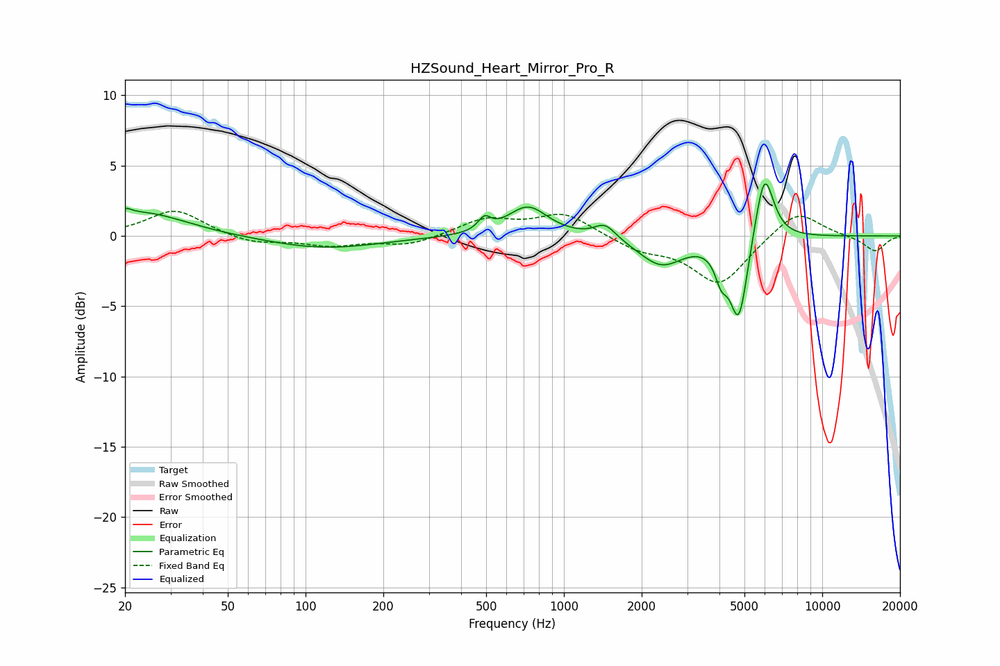

# HZSound_Heart_Mirror_Pro_R
See [usage instructions](https://github.com/jaakkopasanen/AutoEq#usage) for more options and info.

### Parametric EQs
Apply preamp of -3.8 dB when using parametric equalizer.

|   # | Type    |   Fc (Hz) |    Q |   Gain (dB) |
|-----|---------|-----------|------|-------------|
|   1 | Peaking |        20 | 5.94 |         0.4 |
|   2 | Peaking |        23 | 0.83 |         1.7 |
|   3 | Peaking |       117 | 0.65 |        -0.9 |
|   4 | Peaking |       492 | 5.94 |         0.9 |
|   5 | Peaking |       725 | 1.84 |         2.1 |
|   6 | Peaking |      1444 | 3.39 |         1   |
|   7 | Peaking |      2380 | 1.63 |        -2.1 |
|   8 | Peaking |      4064 | 5.8  |        -1.8 |
|   9 | Peaking |      4756 | 3.99 |        -6   |
|  10 | Peaking |      5967 | 3.78 |         5.1 |

### Fixed Band EQs
When using fixed band (also called graphic) equalizer, apply preamp of **-1.8 dB** (if available) and set gains manually with these parameters.

|   # | Type    |   Fc (Hz) |    Q |   Gain (dB) |
|-----|---------|-----------|------|-------------|
|   1 | Peaking |        31 | 1.41 |         1.9 |
|   2 | Peaking |        62 | 1.41 |        -0.6 |
|   3 | Peaking |       125 | 1.41 |        -0.6 |
|   4 | Peaking |       250 | 1.41 |        -0.7 |
|   5 | Peaking |       500 | 1.41 |         1.2 |
|   6 | Peaking |      1000 | 1.41 |         1.6 |
|   7 | Peaking |      2000 | 1.41 |        -0.9 |
|   8 | Peaking |      4000 | 1.41 |        -3.4 |
|   9 | Peaking |      8000 | 1.41 |         1.9 |
|  10 | Peaking |     16000 | 1.41 |        -1.1 |

### Graphs

