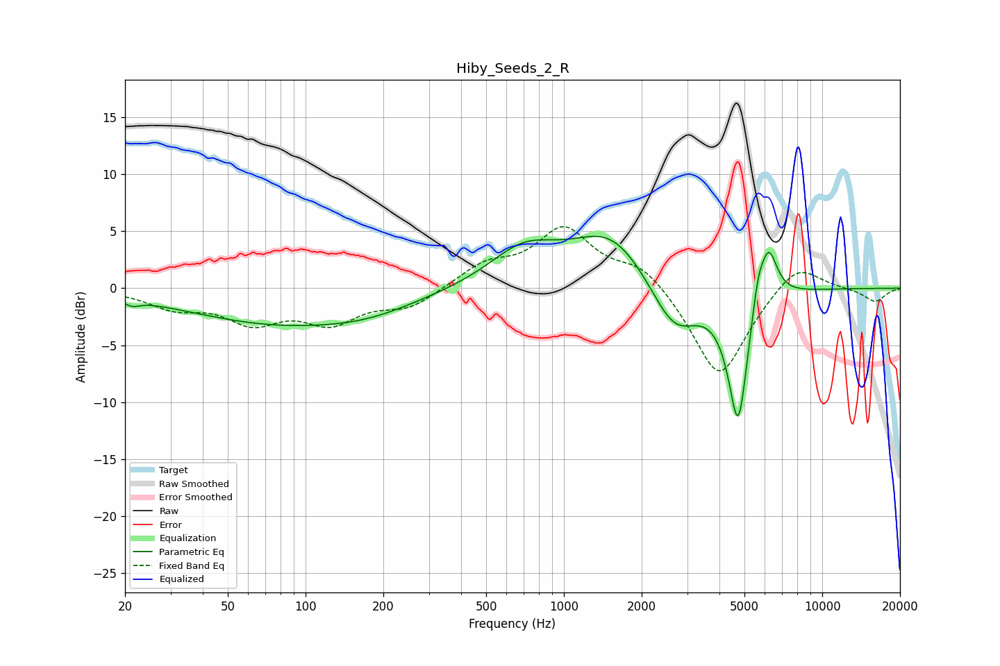

# Hiby_Seeds_2_R
See [usage instructions](https://github.com/jaakkopasanen/AutoEq#usage) for more options and info.

### Parametric EQs
Apply preamp of -4.6 dB when using parametric equalizer.

|   # | Type    |   Fc (Hz) |    Q |   Gain (dB) |
|-----|---------|-----------|------|-------------|
|   1 | Peaking |        21 | 4.69 |        -0.5 |
|   2 | Peaking |        80 | 0.39 |        -3   |
|   3 | Peaking |       179 | 0.79 |        -0.8 |
|   4 | Peaking |       699 | 1.05 |         3.2 |
|   5 | Peaking |      1524 | 0.93 |         4.8 |
|   6 | Peaking |      2674 | 1.49 |        -4.7 |
|   7 | Peaking |      4605 | 2.2  |        -0.6 |
|   8 | Peaking |      4728 | 3.64 |       -11.3 |
|   9 | Peaking |      5634 | 5.94 |         2.5 |
|  10 | Peaking |      6198 | 4.03 |         4.7 |

### Fixed Band EQs
When using fixed band (also called graphic) equalizer, apply preamp of **-5.5 dB** (if available) and set gains manually with these parameters.

|   # | Type    |   Fc (Hz) |    Q |   Gain (dB) |
|-----|---------|-----------|------|-------------|
|   1 | Peaking |        31 | 1.41 |        -1.5 |
|   2 | Peaking |        62 | 1.41 |        -2.7 |
|   3 | Peaking |       125 | 1.41 |        -2.7 |
|   4 | Peaking |       250 | 1.41 |        -1.6 |
|   5 | Peaking |       500 | 1.41 |         1.9 |
|   6 | Peaking |      1000 | 1.41 |         5   |
|   7 | Peaking |      2000 | 1.41 |         2.1 |
|   8 | Peaking |      4000 | 1.41 |        -8.1 |
|   9 | Peaking |      8000 | 1.41 |         2.5 |
|  10 | Peaking |     16000 | 1.41 |        -1.2 |

### Graphs

