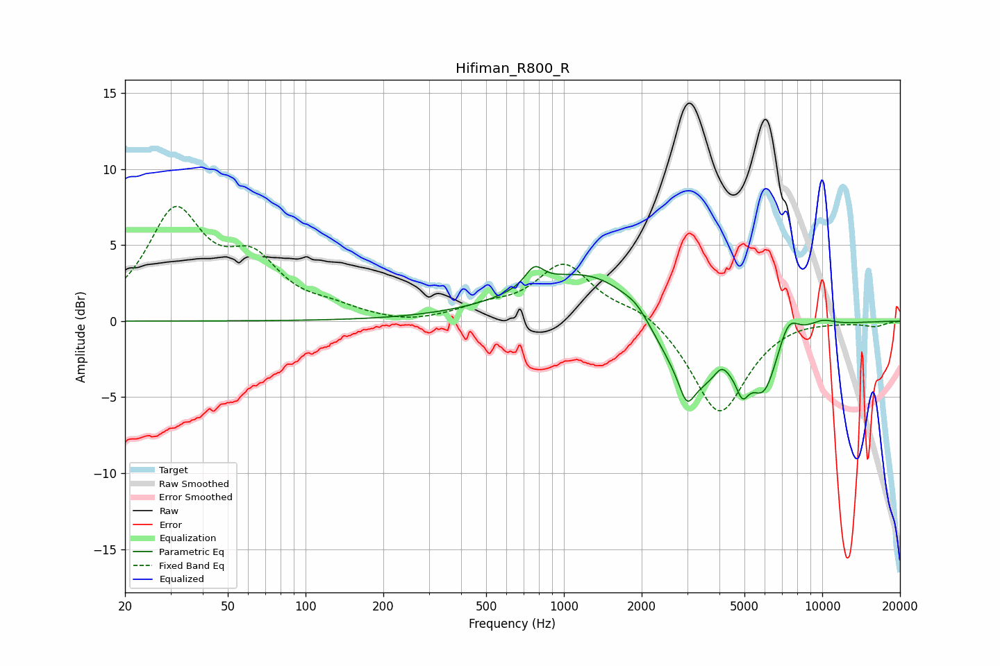

# Hifiman_R800_R
See [usage instructions](https://github.com/jaakkopasanen/AutoEq#usage) for more options and info.

### Parametric EQs
Apply preamp of -3.7 dB when using parametric equalizer.

|   # | Type    |   Fc (Hz) |    Q |   Gain (dB) |
|-----|---------|-----------|------|-------------|
|   1 | Peaking |       768 | 4.07 |         1.3 |
|   2 | Peaking |      1419 | 0.55 |         4.3 |
|   3 | Peaking |      1919 | 3.24 |         0.5 |
|   4 | Peaking |      2990 | 5.07 |        -1.7 |
|   5 | Peaking |      3094 | 0.9  |        -5.8 |
|   6 | Peaking |      4079 | 4.9  |         0.8 |
|   7 | Peaking |      4908 | 5.65 |        -1.7 |
|   8 | Peaking |      5959 | 2.6  |        -3.4 |
|   9 | Peaking |      7396 | 3.45 |         1.6 |
|  10 | Peaking |     10000 | 2.44 |         0.5 |

### Fixed Band EQs
When using fixed band (also called graphic) equalizer, apply preamp of **-7.6 dB** (if available) and set gains manually with these parameters.

|   # | Type    |   Fc (Hz) |    Q |   Gain (dB) |
|-----|---------|-----------|------|-------------|
|   1 | Peaking |        31 | 1.41 |         6.9 |
|   2 | Peaking |        62 | 1.41 |         3.4 |
|   3 | Peaking |       125 | 1.41 |         0.6 |
|   4 | Peaking |       250 | 1.41 |        -0.3 |
|   5 | Peaking |       500 | 1.41 |         0.7 |
|   6 | Peaking |      1000 | 1.41 |         3.7 |
|   7 | Peaking |      2000 | 1.41 |         0.9 |
|   8 | Peaking |      4000 | 1.41 |        -6.2 |
|   9 | Peaking |      8000 | 1.41 |         0.2 |
|  10 | Peaking |     16000 | 1.41 |        -0.3 |

### Graphs

