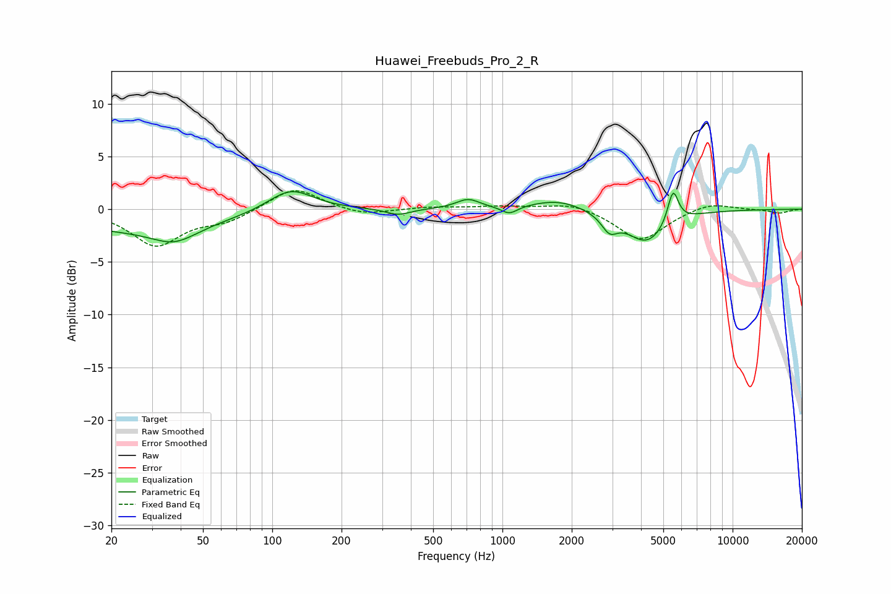

# Huawei_Freebuds_Pro_2_R
See [usage instructions](https://github.com/jaakkopasanen/AutoEq#usage) for more options and info.

### Parametric EQs
Apply preamp of -1.8 dB when using parametric equalizer.

|   # | Type    |   Fc (Hz) |    Q |   Gain (dB) |
|-----|---------|-----------|------|-------------|
|   1 | Peaking |        25 | 0.39 |        -1.9 |
|   2 | Peaking |        38 | 1.47 |        -1.5 |
|   3 | Peaking |       120 | 1.43 |         2.2 |
|   4 | Peaking |       352 | 2.6  |        -0.6 |
|   5 | Peaking |       709 | 2.78 |         0.9 |
|   6 | Peaking |      1072 | 4.02 |        -0.7 |
|   7 | Peaking |      1744 | 1.22 |         1   |
|   8 | Peaking |      2917 | 4.08 |        -1.5 |
|   9 | Peaking |      4239 | 1.57 |        -3.2 |
|  10 | Peaking |      5508 | 5.92 |         3.2 |

### Fixed Band EQs
When using fixed band (also called graphic) equalizer, apply preamp of **-1.8 dB** (if available) and set gains manually with these parameters.

|   # | Type    |   Fc (Hz) |    Q |   Gain (dB) |
|-----|---------|-----------|------|-------------|
|   1 | Peaking |        31 | 1.41 |        -3.4 |
|   2 | Peaking |        62 | 1.41 |        -1.1 |
|   3 | Peaking |       125 | 1.41 |         2.2 |
|   4 | Peaking |       250 | 1.41 |        -0.6 |
|   5 | Peaking |       500 | 1.41 |         0.2 |
|   6 | Peaking |      1000 | 1.41 |         0.3 |
|   7 | Peaking |      2000 | 1.41 |         0.7 |
|   8 | Peaking |      4000 | 1.41 |        -3   |
|   9 | Peaking |      8000 | 1.41 |         0.7 |
|  10 | Peaking |     16000 | 1.41 |        -0.4 |

### Graphs

