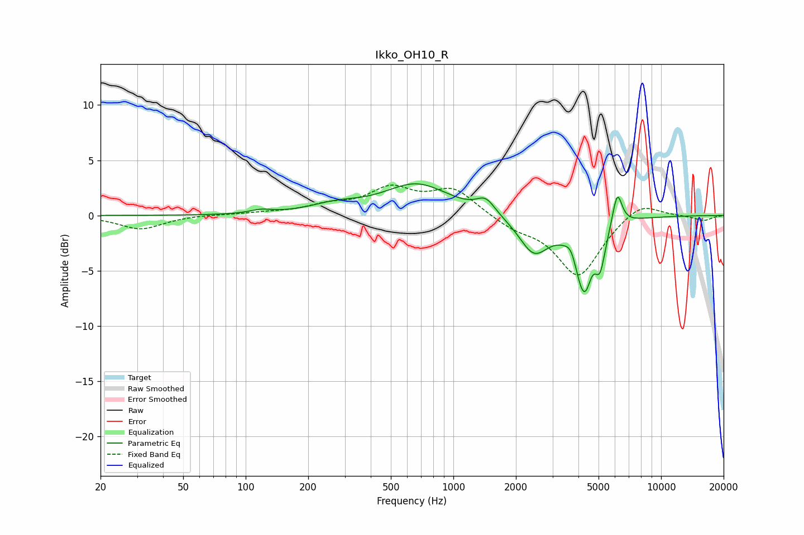

# Ikko_OH10_R
See [usage instructions](https://github.com/jaakkopasanen/AutoEq#usage) for more options and info.

### Parametric EQs
Apply preamp of -3.0 dB when using parametric equalizer.

|   # | Type    |   Fc (Hz) |    Q |   Gain (dB) |
|-----|---------|-----------|------|-------------|
|   1 | Peaking |       118 | 2.75 |         0.3 |
|   2 | Peaking |       270 | 1.15 |         0.7 |
|   3 | Peaking |       668 | 0.91 |         2.8 |
|   4 | Peaking |      1432 | 3.17 |         1.3 |
|   5 | Peaking |      2441 | 1.97 |        -3.3 |
|   6 | Peaking |      3698 | 5.17 |         1.2 |
|   7 | Peaking |      4288 | 2.85 |        -7.1 |
|   8 | Peaking |      4630 | 6    |         1.1 |
|   9 | Peaking |      5097 | 6    |        -2.6 |
|  10 | Peaking |      6151 | 5.87 |         3.2 |

### Fixed Band EQs
When using fixed band (also called graphic) equalizer, apply preamp of **-2.8 dB** (if available) and set gains manually with these parameters.

|   # | Type    |   Fc (Hz) |    Q |   Gain (dB) |
|-----|---------|-----------|------|-------------|
|   1 | Peaking |        31 | 1.41 |        -1.2 |
|   2 | Peaking |        62 | 1.41 |         0.1 |
|   3 | Peaking |       125 | 1.41 |         0.2 |
|   4 | Peaking |       250 | 1.41 |         0.8 |
|   5 | Peaking |       500 | 1.41 |         2.2 |
|   6 | Peaking |      1000 | 1.41 |         2.3 |
|   7 | Peaking |      2000 | 1.41 |        -1   |
|   8 | Peaking |      4000 | 1.41 |        -5.5 |
|   9 | Peaking |      8000 | 1.41 |         1.4 |
|  10 | Peaking |     16000 | 1.41 |        -0.5 |

### Graphs

