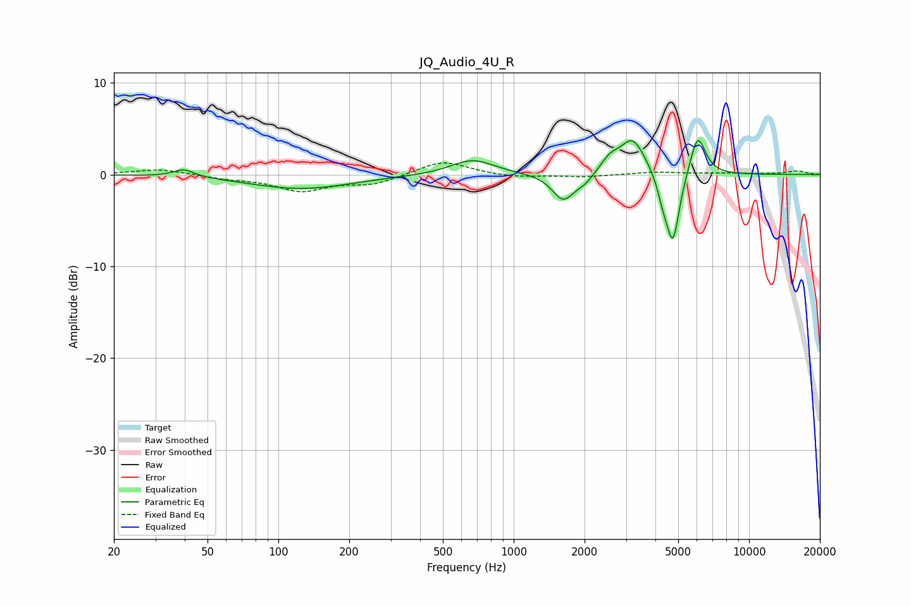

# JQ_Audio_4U_R
See [usage instructions](https://github.com/jaakkopasanen/AutoEq#usage) for more options and info.

### Parametric EQs
Apply preamp of -3.8 dB when using parametric equalizer.

|   # | Type    |   Fc (Hz) |    Q |   Gain (dB) |
|-----|---------|-----------|------|-------------|
|   1 | Peaking |        40 | 3.2  |         0.8 |
|   2 | Peaking |       125 | 0.65 |        -1.5 |
|   3 | Peaking |       668 | 1.55 |         1.7 |
|   4 | Peaking |      1625 | 3.04 |        -2.9 |
|   5 | Peaking |      2002 | 3.92 |        -0.8 |
|   6 | Peaking |      2560 | 3.62 |         1.3 |
|   7 | Peaking |      3203 | 2.58 |         3.9 |
|   8 | Peaking |      4312 | 5.97 |        -1.8 |
|   9 | Peaking |      4748 | 4.89 |        -7.6 |
|  10 | Peaking |      6049 | 4.21 |         4.6 |

### Fixed Band EQs
When using fixed band (also called graphic) equalizer, apply preamp of **-1.4 dB** (if available) and set gains manually with these parameters.

|   # | Type    |   Fc (Hz) |    Q |   Gain (dB) |
|-----|---------|-----------|------|-------------|
|   1 | Peaking |        31 | 1.41 |         0.6 |
|   2 | Peaking |        62 | 1.41 |        -0.4 |
|   3 | Peaking |       125 | 1.41 |        -1.7 |
|   4 | Peaking |       250 | 1.41 |        -1   |
|   5 | Peaking |       500 | 1.41 |         1.6 |
|   6 | Peaking |      1000 | 1.41 |        -0.3 |
|   7 | Peaking |      2000 | 1.41 |        -0.2 |
|   8 | Peaking |      4000 | 1.41 |         0.3 |
|   9 | Peaking |      8000 | 1.41 |         0.1 |
|  10 | Peaking |     16000 | 1.41 |         0.4 |

### Graphs

