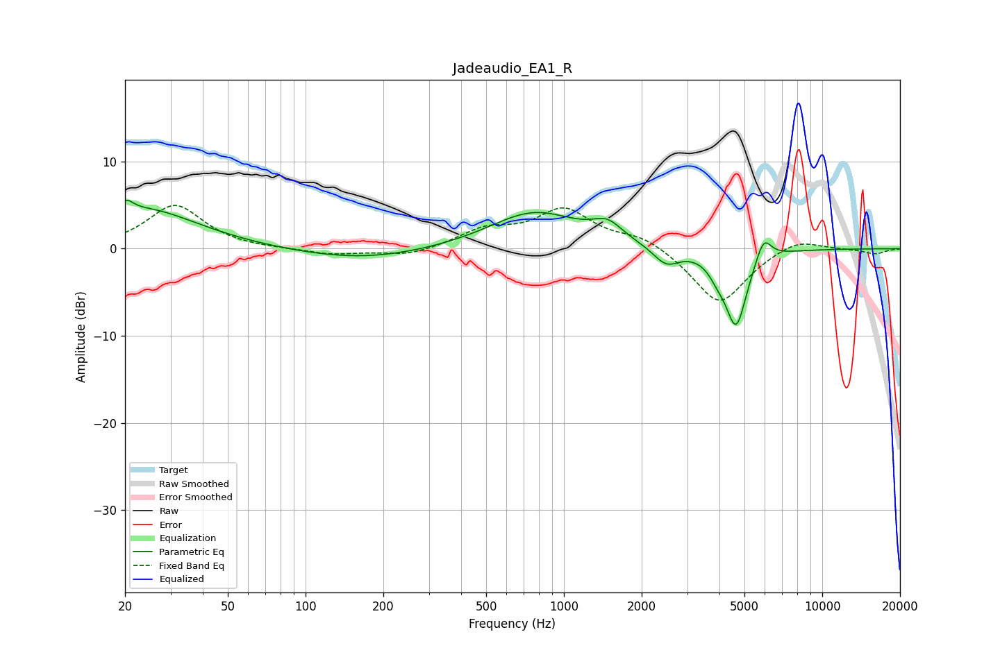

# Jadeaudio_EA1_R
See [usage instructions](https://github.com/jaakkopasanen/AutoEq#usage) for more options and info.

### Parametric EQs
Apply preamp of -5.7 dB when using parametric equalizer.

|   # | Type    |   Fc (Hz) |    Q |   Gain (dB) |
|-----|---------|-----------|------|-------------|
|   1 | Peaking |        20 | 5.87 |         3.3 |
|   2 | Peaking |        20 | 5.97 |        -2.1 |
|   3 | Peaking |        23 | 0.66 |         4.6 |
|   4 | Peaking |       164 | 0.56 |        -1.3 |
|   5 | Peaking |       769 | 0.81 |         4.2 |
|   6 | Peaking |      1475 | 2.47 |         1.9 |
|   7 | Peaking |      2488 | 2.75 |        -2.1 |
|   8 | Peaking |      3922 | 4.36 |        -1.1 |
|   9 | Peaking |      4639 | 3.26 |        -8.8 |
|  10 | Peaking |      5924 | 4.61 |         2.8 |

### Fixed Band EQs
When using fixed band (also called graphic) equalizer, apply preamp of **-5.1 dB** (if available) and set gains manually with these parameters.

|   # | Type    |   Fc (Hz) |    Q |   Gain (dB) |
|-----|---------|-----------|------|-------------|
|   1 | Peaking |        31 | 1.41 |         5   |
|   2 | Peaking |        62 | 1.41 |        -0.1 |
|   3 | Peaking |       125 | 1.41 |        -0.7 |
|   4 | Peaking |       250 | 1.41 |        -0.9 |
|   5 | Peaking |       500 | 1.41 |         2   |
|   6 | Peaking |      1000 | 1.41 |         4.3 |
|   7 | Peaking |      2000 | 1.41 |         1.4 |
|   8 | Peaking |      4000 | 1.41 |        -6.5 |
|   9 | Peaking |      8000 | 1.41 |         1.4 |
|  10 | Peaking |     16000 | 1.41 |        -0.6 |

### Graphs

