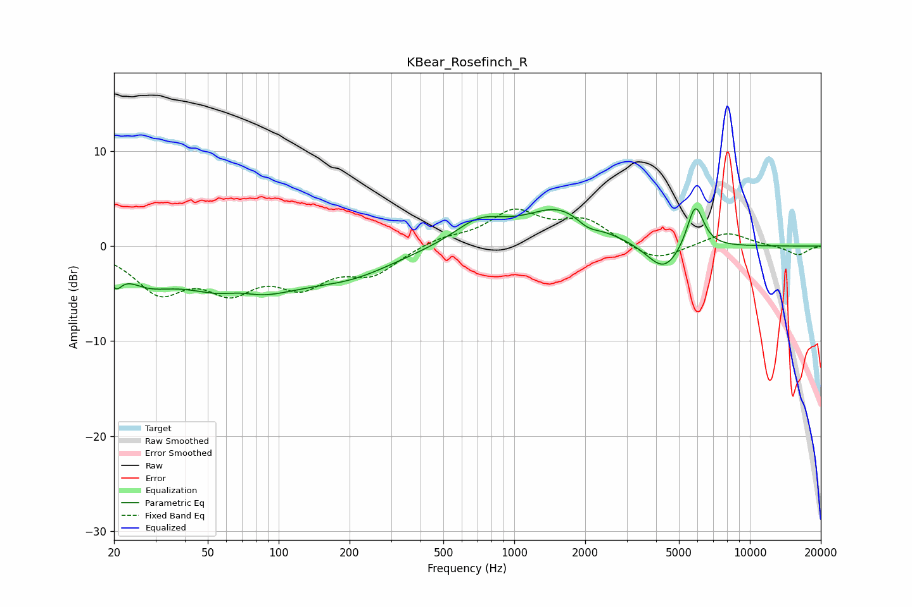

# KBear_Rosefinch_R
See [usage instructions](https://github.com/jaakkopasanen/AutoEq#usage) for more options and info.

### Parametric EQs
Apply preamp of -4.0 dB when using parametric equalizer.

|   # | Type    |   Fc (Hz) |    Q |   Gain (dB) |
|-----|---------|-----------|------|-------------|
|   1 | Peaking |        20 | 5.58 |        -1.9 |
|   2 | Peaking |        27 | 1.35 |        -2.2 |
|   3 | Peaking |        69 | 1.89 |         0.9 |
|   4 | Peaking |        69 | 0.6  |        -5.2 |
|   5 | Peaking |       207 | 0.74 |        -2.2 |
|   6 | Peaking |       709 | 1.31 |         2.4 |
|   7 | Peaking |      1567 | 0.94 |         3.9 |
|   8 | Peaking |      2047 | 2.86 |        -0.9 |
|   9 | Peaking |      4321 | 1.9  |        -3.1 |
|  10 | Peaking |      5866 | 3.86 |         4.8 |

### Fixed Band EQs
When using fixed band (also called graphic) equalizer, apply preamp of **-4.0 dB** (if available) and set gains manually with these parameters.

|   # | Type    |   Fc (Hz) |    Q |   Gain (dB) |
|-----|---------|-----------|------|-------------|
|   1 | Peaking |        31 | 1.41 |        -4.4 |
|   2 | Peaking |        62 | 1.41 |        -3.9 |
|   3 | Peaking |       125 | 1.41 |        -3.5 |
|   4 | Peaking |       250 | 1.41 |        -2.7 |
|   5 | Peaking |       500 | 1.41 |         0.8 |
|   6 | Peaking |      1000 | 1.41 |         3.5 |
|   7 | Peaking |      2000 | 1.41 |         2.5 |
|   8 | Peaking |      4000 | 1.41 |        -1.8 |
|   9 | Peaking |      8000 | 1.41 |         1.5 |
|  10 | Peaking |     16000 | 1.41 |        -1   |

### Graphs

