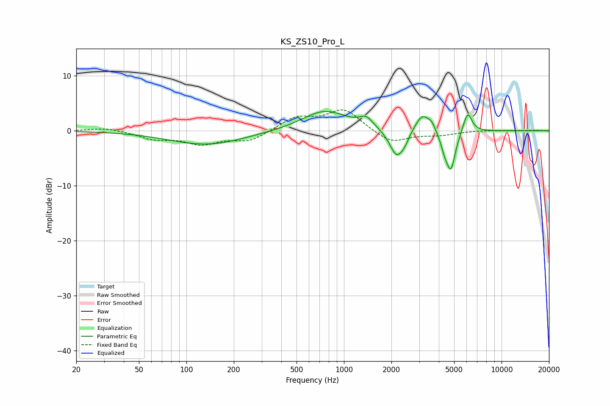

# KS_ZS10_Pro_L
See [usage instructions](https://github.com/jaakkopasanen/AutoEq#usage) for more options and info.

### Parametric EQs
Apply preamp of -3.6 dB when using parametric equalizer.

|   # | Type    |   Fc (Hz) |    Q |   Gain (dB) |
|-----|---------|-----------|------|-------------|
|   1 | Peaking |       134 | 0.59 |        -2.5 |
|   2 | Peaking |       756 | 0.98 |         3.7 |
|   3 | Peaking |      1385 | 3.42 |         1.7 |
|   4 | Peaking |      2160 | 3.16 |        -5   |
|   5 | Peaking |      2437 | 5.47 |        -1.1 |
|   6 | Peaking |      3142 | 3.09 |         3.2 |
|   7 | Peaking |      3593 | 6    |         1.1 |
|   8 | Peaking |      4337 | 5.98 |        -2   |
|   9 | Peaking |      4770 | 4.8  |        -6.9 |
|  10 | Peaking |      6087 | 5.06 |         3.8 |

### Fixed Band EQs
When using fixed band (also called graphic) equalizer, apply preamp of **-3.9 dB** (if available) and set gains manually with these parameters.

|   # | Type    |   Fc (Hz) |    Q |   Gain (dB) |
|-----|---------|-----------|------|-------------|
|   1 | Peaking |        31 | 1.41 |         0.6 |
|   2 | Peaking |        62 | 1.41 |        -1.4 |
|   3 | Peaking |       125 | 1.41 |        -2.2 |
|   4 | Peaking |       250 | 1.41 |        -1.8 |
|   5 | Peaking |       500 | 1.41 |         2.4 |
|   6 | Peaking |      1000 | 1.41 |         3.9 |
|   7 | Peaking |      2000 | 1.41 |        -2.3 |
|   8 | Peaking |      4000 | 1.41 |        -0.7 |
|   9 | Peaking |      8000 | 1.41 |         0.1 |
|  10 | Peaking |     16000 | 1.41 |         0.1 |

### Graphs

