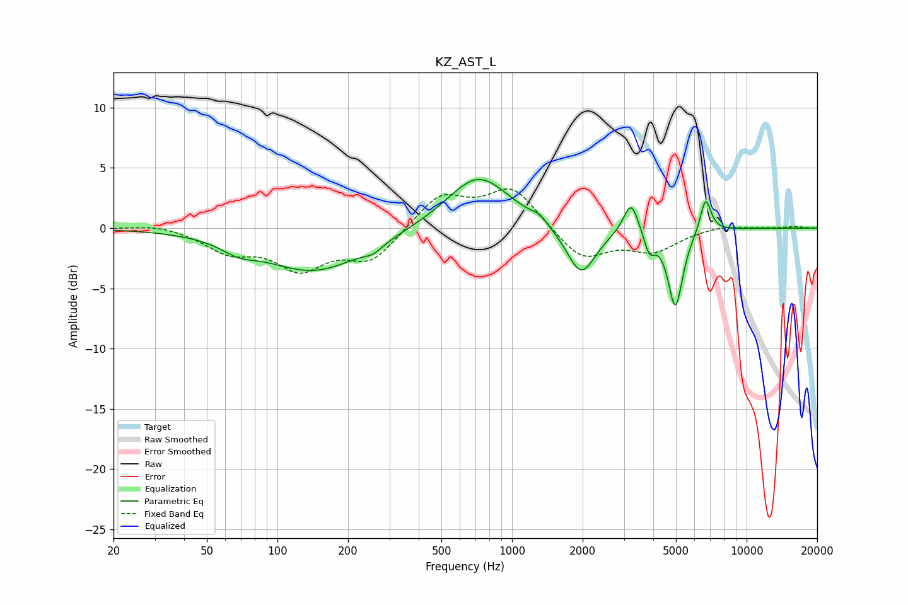

# KZ_AST_L
See [usage instructions](https://github.com/jaakkopasanen/AutoEq#usage) for more options and info.

### Parametric EQs
Apply preamp of -4.1 dB when using parametric equalizer.

|   # | Type    |   Fc (Hz) |    Q |   Gain (dB) |
|-----|---------|-----------|------|-------------|
|   1 | Peaking |        68 | 1.92 |        -0.8 |
|   2 | Peaking |       144 | 0.66 |        -3.6 |
|   3 | Peaking |       256 | 3.56 |        -0.6 |
|   4 | Peaking |       718 | 1.06 |         4.5 |
|   5 | Peaking |      1307 | 4.14 |         0.5 |
|   6 | Peaking |      1971 | 2.26 |        -4.1 |
|   7 | Peaking |      3221 | 4.38 |         2.8 |
|   8 | Peaking |      3851 | 6    |        -1.7 |
|   9 | Peaking |      4973 | 4.43 |        -6.5 |
|  10 | Peaking |      6689 | 5.97 |         2.9 |

### Fixed Band EQs
When using fixed band (also called graphic) equalizer, apply preamp of **-3.3 dB** (if available) and set gains manually with these parameters.

|   # | Type    |   Fc (Hz) |    Q |   Gain (dB) |
|-----|---------|-----------|------|-------------|
|   1 | Peaking |        31 | 1.41 |         0.4 |
|   2 | Peaking |        62 | 1.41 |        -1.8 |
|   3 | Peaking |       125 | 1.41 |        -3.1 |
|   4 | Peaking |       250 | 1.41 |        -2.6 |
|   5 | Peaking |       500 | 1.41 |         2.8 |
|   6 | Peaking |      1000 | 1.41 |         3.3 |
|   7 | Peaking |      2000 | 1.41 |        -2.6 |
|   8 | Peaking |      4000 | 1.41 |        -1.8 |
|   9 | Peaking |      8000 | 1.41 |         0.3 |
|  10 | Peaking |     16000 | 1.41 |         0.1 |

### Graphs

