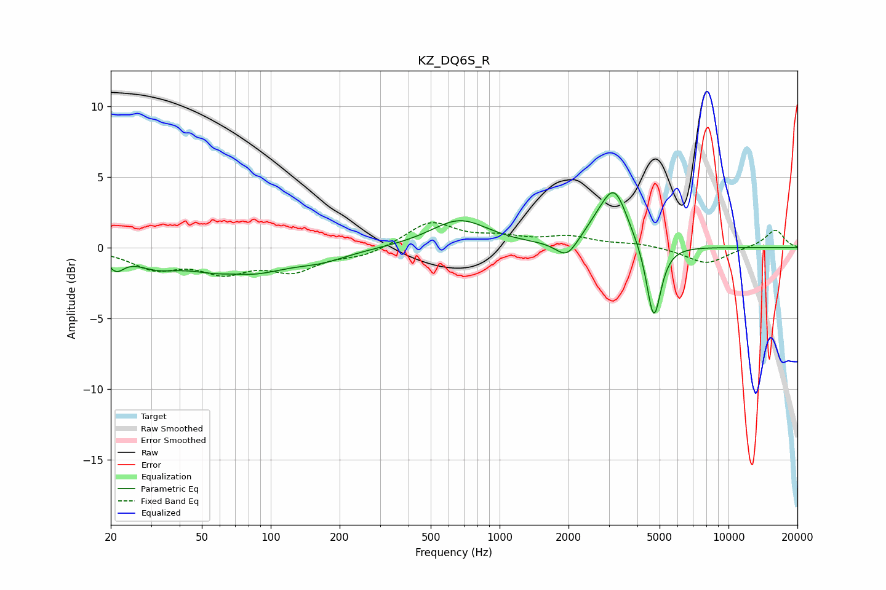

# KZ_DQ6S_R
See [usage instructions](https://github.com/jaakkopasanen/AutoEq#usage) for more options and info.

### Parametric EQs
Apply preamp of -4.0 dB when using parametric equalizer.

|   # | Type    |   Fc (Hz) |    Q |   Gain (dB) |
|-----|---------|-----------|------|-------------|
|   1 | Peaking |        21 | 4.19 |        -1.1 |
|   2 | Peaking |        32 | 1.53 |        -0.9 |
|   3 | Peaking |        70 | 1.94 |         0.4 |
|   4 | Peaking |        72 | 0.77 |        -2.1 |
|   5 | Peaking |       168 | 1.23 |        -0.6 |
|   6 | Peaking |       669 | 1.12 |         2   |
|   7 | Peaking |      1966 | 3    |        -1.3 |
|   8 | Peaking |      2661 | 2.08 |         0.8 |
|   9 | Peaking |      3176 | 2.42 |         3.8 |
|  10 | Peaking |      4716 | 4.47 |        -5.5 |

### Fixed Band EQs
When using fixed band (also called graphic) equalizer, apply preamp of **-1.9 dB** (if available) and set gains manually with these parameters.

|   # | Type    |   Fc (Hz) |    Q |   Gain (dB) |
|-----|---------|-----------|------|-------------|
|   1 | Peaking |        31 | 1.41 |        -1.3 |
|   2 | Peaking |        62 | 1.41 |        -1.5 |
|   3 | Peaking |       125 | 1.41 |        -1.5 |
|   4 | Peaking |       250 | 1.41 |        -0.6 |
|   5 | Peaking |       500 | 1.41 |         1.8 |
|   6 | Peaking |      1000 | 1.41 |         0.6 |
|   7 | Peaking |      2000 | 1.41 |         0.7 |
|   8 | Peaking |      4000 | 1.41 |         0.3 |
|   9 | Peaking |      8000 | 1.41 |        -1.2 |
|  10 | Peaking |     16000 | 1.41 |         1.3 |

### Graphs

