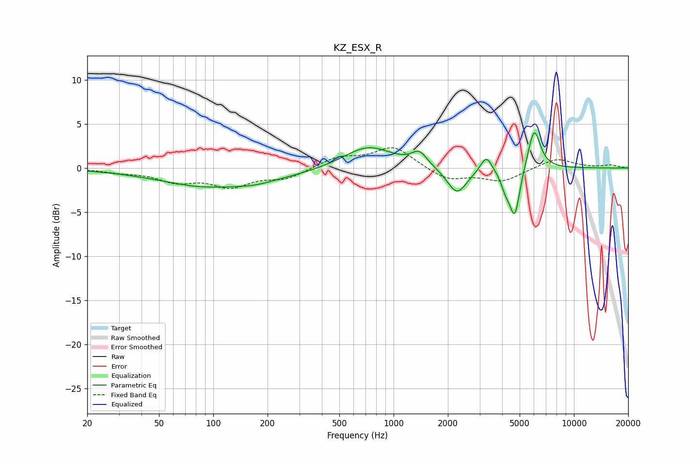

# KZ_ESX_R
See [usage instructions](https://github.com/jaakkopasanen/AutoEq#usage) for more options and info.

### Parametric EQs
Apply preamp of -4.1 dB when using parametric equalizer.

|   # | Type    |   Fc (Hz) |    Q |   Gain (dB) |
|-----|---------|-----------|------|-------------|
|   1 | Peaking |        77 | 1.84 |        -0.1 |
|   2 | Peaking |       111 | 0.42 |        -2.2 |
|   3 | Peaking |       173 | 2.03 |        -0.2 |
|   4 | Peaking |       722 | 1.04 |         2.5 |
|   5 | Peaking |      1389 | 3.32 |         1.5 |
|   6 | Peaking |      2248 | 2.56 |        -3   |
|   7 | Peaking |      3266 | 4.57 |         1.8 |
|   8 | Peaking |      4179 | 5.56 |        -1.6 |
|   9 | Peaking |      4698 | 4.89 |        -5.5 |
|  10 | Peaking |      6016 | 4.05 |         4.7 |

### Fixed Band EQs
When using fixed band (also called graphic) equalizer, apply preamp of **-2.4 dB** (if available) and set gains manually with these parameters.

|   # | Type    |   Fc (Hz) |    Q |   Gain (dB) |
|-----|---------|-----------|------|-------------|
|   1 | Peaking |        31 | 1.41 |        -0.4 |
|   2 | Peaking |        62 | 1.41 |        -1.4 |
|   3 | Peaking |       125 | 1.41 |        -1.9 |
|   4 | Peaking |       250 | 1.41 |        -1.1 |
|   5 | Peaking |       500 | 1.41 |         1.2 |
|   6 | Peaking |      1000 | 1.41 |         2.4 |
|   7 | Peaking |      2000 | 1.41 |        -1.4 |
|   8 | Peaking |      4000 | 1.41 |        -1.5 |
|   9 | Peaking |      8000 | 1.41 |         1.1 |
|  10 | Peaking |     16000 | 1.41 |         0.3 |

### Graphs

