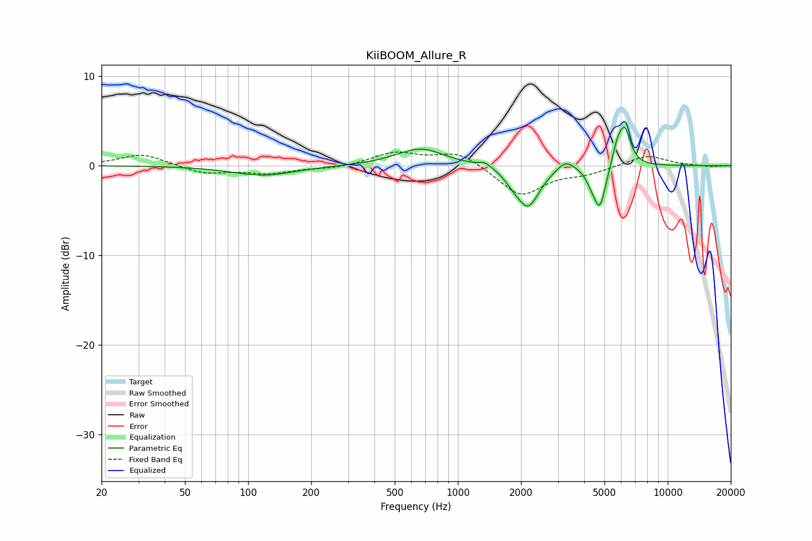

# KiiBOOM_Allure_R
See [usage instructions](https://github.com/jaakkopasanen/AutoEq#usage) for more options and info.

### Parametric EQs
Apply preamp of -4.4 dB when using parametric equalizer.

|   # | Type    |   Fc (Hz) |    Q |   Gain (dB) |
|-----|---------|-----------|------|-------------|
|   1 | Peaking |       118 | 0.94 |        -1.1 |
|   2 | Peaking |       661 | 1.24 |         1.9 |
|   3 | Peaking |      1349 | 4.55 |         0.6 |
|   4 | Peaking |      1814 | 4.22 |        -0.6 |
|   5 | Peaking |      2156 | 2.58 |        -4.5 |
|   6 | Peaking |      3262 | 3.57 |         1.2 |
|   7 | Peaking |      4318 | 6    |        -0.9 |
|   8 | Peaking |      4749 | 4.93 |        -4.6 |
|   9 | Peaking |      5745 | 5.95 |         1.8 |
|  10 | Peaking |      6243 | 4.83 |         4   |

### Fixed Band EQs
When using fixed band (also called graphic) equalizer, apply preamp of **-1.6 dB** (if available) and set gains manually with these parameters.

|   # | Type    |   Fc (Hz) |    Q |   Gain (dB) |
|-----|---------|-----------|------|-------------|
|   1 | Peaking |        31 | 1.41 |         1.3 |
|   2 | Peaking |        62 | 1.41 |        -0.9 |
|   3 | Peaking |       125 | 1.41 |        -0.8 |
|   4 | Peaking |       250 | 1.41 |        -0.3 |
|   5 | Peaking |       500 | 1.41 |         1.4 |
|   6 | Peaking |      1000 | 1.41 |         1.6 |
|   7 | Peaking |      2000 | 1.41 |        -3.4 |
|   8 | Peaking |      4000 | 1.41 |        -0.8 |
|   9 | Peaking |      8000 | 1.41 |         1.2 |
|  10 | Peaking |     16000 | 1.41 |        -0.1 |

### Graphs

