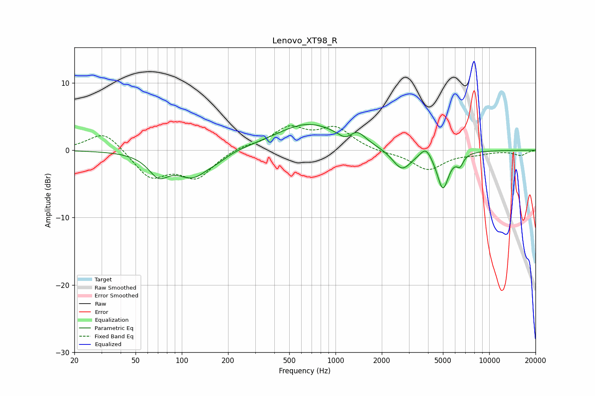

# Lenovo_XT98_R
See [usage instructions](https://github.com/jaakkopasanen/AutoEq#usage) for more options and info.

### Parametric EQs
Apply preamp of -3.9 dB when using parametric equalizer.

|   # | Type    |   Fc (Hz) |    Q |   Gain (dB) |
|-----|---------|-----------|------|-------------|
|   1 | Peaking |        71 | 2.14 |        -3   |
|   2 | Peaking |       118 | 1.34 |        -3.7 |
|   3 | Peaking |       171 | 2.19 |        -0.6 |
|   4 | Peaking |       666 | 0.68 |         3.9 |
|   5 | Peaking |      1164 | 3.2  |        -1   |
|   6 | Peaking |      1386 | 2.78 |         1.5 |
|   7 | Peaking |      2706 | 2.26 |        -3.1 |
|   8 | Peaking |      3870 | 4.06 |         1.5 |
|   9 | Peaking |      4995 | 3.66 |        -5.6 |
|  10 | Peaking |      6451 | 6    |        -1.5 |

### Fixed Band EQs
When using fixed band (also called graphic) equalizer, apply preamp of **-3.7 dB** (if available) and set gains manually with these parameters.

|   # | Type    |   Fc (Hz) |    Q |   Gain (dB) |
|-----|---------|-----------|------|-------------|
|   1 | Peaking |        31 | 1.41 |         3   |
|   2 | Peaking |        62 | 1.41 |        -4   |
|   3 | Peaking |       125 | 1.41 |        -3.9 |
|   4 | Peaking |       250 | 1.41 |         0.7 |
|   5 | Peaking |       500 | 1.41 |         3.1 |
|   6 | Peaking |      1000 | 1.41 |         3.1 |
|   7 | Peaking |      2000 | 1.41 |        -0.3 |
|   8 | Peaking |      4000 | 1.41 |        -2.9 |
|   9 | Peaking |      8000 | 1.41 |        -0.4 |
|  10 | Peaking |     16000 | 1.41 |        -0.7 |

### Graphs

