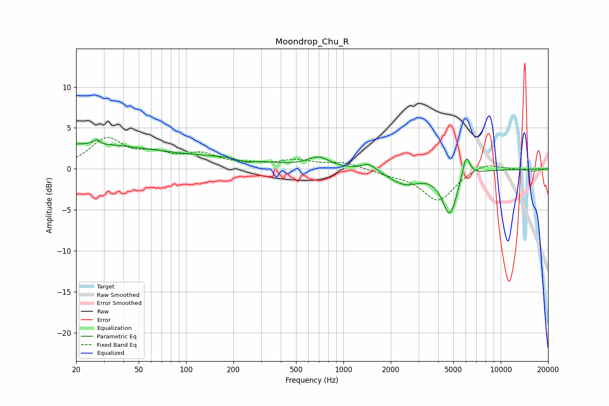

# Moondrop_Chu_R
See [usage instructions](https://github.com/jaakkopasanen/AutoEq#usage) for more options and info.

### Parametric EQs
Apply preamp of -3.6 dB when using parametric equalizer.

|   # | Type    |   Fc (Hz) |    Q |   Gain (dB) |
|-----|---------|-----------|------|-------------|
|   1 | Peaking |        21 | 0.26 |         3   |
|   2 | Peaking |        28 | 5.96 |         2.9 |
|   3 | Peaking |        28 | 5.98 |        -2.4 |
|   4 | Peaking |       185 | 0.54 |         1   |
|   5 | Peaking |       239 | 3.53 |        -0.4 |
|   6 | Peaking |       694 | 2.04 |         1.3 |
|   7 | Peaking |      1452 | 3.16 |         0.9 |
|   8 | Peaking |      2459 | 1.43 |        -1.8 |
|   9 | Peaking |      4741 | 2.92 |        -5.3 |
|  10 | Peaking |      6021 | 5.67 |         2.9 |

### Fixed Band EQs
When using fixed band (also called graphic) equalizer, apply preamp of **-3.9 dB** (if available) and set gains manually with these parameters.

|   # | Type    |   Fc (Hz) |    Q |   Gain (dB) |
|-----|---------|-----------|------|-------------|
|   1 | Peaking |        31 | 1.41 |         3.5 |
|   2 | Peaking |        62 | 1.41 |         1.4 |
|   3 | Peaking |       125 | 1.41 |         1.6 |
|   4 | Peaking |       250 | 1.41 |         0.4 |
|   5 | Peaking |       500 | 1.41 |         0.9 |
|   6 | Peaking |      1000 | 1.41 |         0.8 |
|   7 | Peaking |      2000 | 1.41 |        -0.5 |
|   8 | Peaking |      4000 | 1.41 |        -3.9 |
|   9 | Peaking |      8000 | 1.41 |         0.9 |
|  10 | Peaking |     16000 | 1.41 |        -0.3 |

### Graphs

