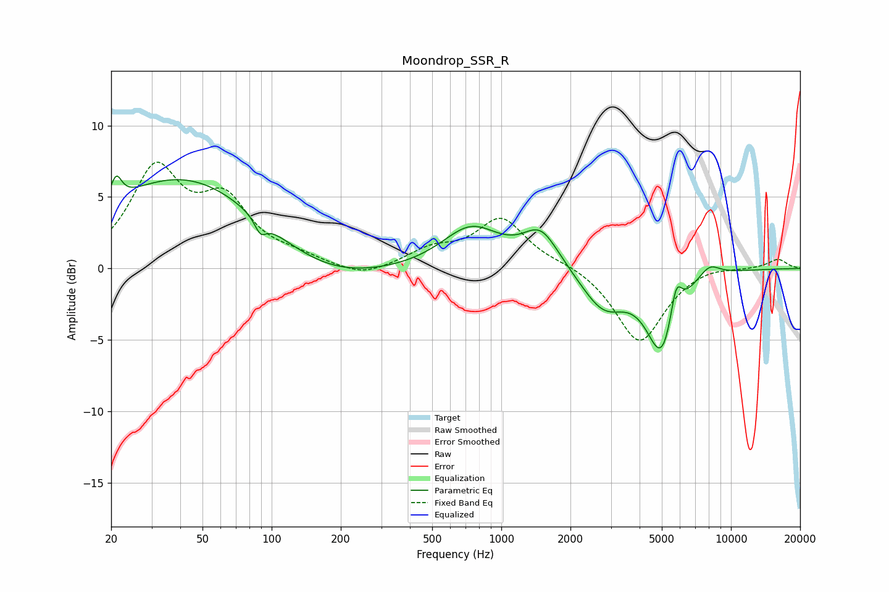

# Moondrop_SSR_R
See [usage instructions](https://github.com/jaakkopasanen/AutoEq#usage) for more options and info.

### Parametric EQs
Apply preamp of -6.6 dB when using parametric equalizer.

|   # | Type    |   Fc (Hz) |    Q |   Gain (dB) |
|-----|---------|-----------|------|-------------|
|   1 | Peaking |        21 | 6    |         1.7 |
|   2 | Peaking |        42 | 0.39 |         6.5 |
|   3 | Peaking |        89 | 5.76 |        -1   |
|   4 | Peaking |       164 | 0.57 |        -1.7 |
|   5 | Peaking |       738 | 1.12 |         2.9 |
|   6 | Peaking |      1487 | 1.8  |         2.6 |
|   7 | Peaking |      2786 | 1.45 |        -2.8 |
|   8 | Peaking |      5014 | 2.08 |        -5.8 |
|   9 | Peaking |      5762 | 5.35 |         2.7 |
|  10 | Peaking |      8046 | 2.75 |         0.9 |

### Fixed Band EQs
When using fixed band (also called graphic) equalizer, apply preamp of **-7.5 dB** (if available) and set gains manually with these parameters.

|   # | Type    |   Fc (Hz) |    Q |   Gain (dB) |
|-----|---------|-----------|------|-------------|
|   1 | Peaking |        31 | 1.41 |         6.6 |
|   2 | Peaking |        62 | 1.41 |         4.2 |
|   3 | Peaking |       125 | 1.41 |         0.6 |
|   4 | Peaking |       250 | 1.41 |        -0.7 |
|   5 | Peaking |       500 | 1.41 |         1.2 |
|   6 | Peaking |      1000 | 1.41 |         3.4 |
|   7 | Peaking |      2000 | 1.41 |         0.3 |
|   8 | Peaking |      4000 | 1.41 |        -5.2 |
|   9 | Peaking |      8000 | 1.41 |         0.3 |
|  10 | Peaking |     16000 | 1.41 |         0.7 |

### Graphs

