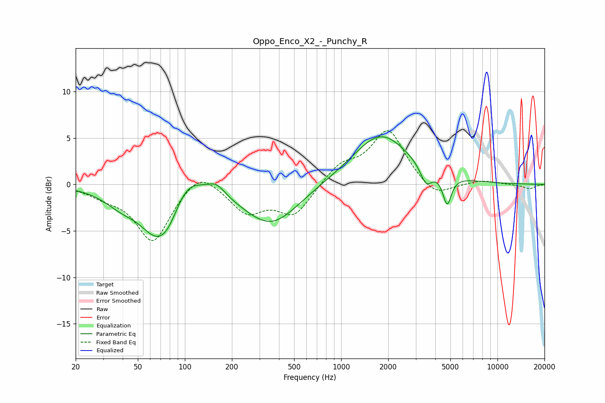

# Oppo_Enco_X2_-_Punchy_R
See [usage instructions](https://github.com/jaakkopasanen/AutoEq#usage) for more options and info.

### Parametric EQs
Apply preamp of -5.2 dB when using parametric equalizer.

|   # | Type    |   Fc (Hz) |    Q |   Gain (dB) |
|-----|---------|-----------|------|-------------|
|   1 | Peaking |        39 | 1.3  |        -1.4 |
|   2 | Peaking |        67 | 1.21 |        -5.3 |
|   3 | Peaking |        79 | 2.31 |        -1.1 |
|   4 | Peaking |       103 | 1.41 |         2.7 |
|   5 | Peaking |       159 | 2.49 |         1.2 |
|   6 | Peaking |       357 | 0.8  |        -4.4 |
|   7 | Peaking |      1790 | 0.82 |         4.8 |
|   8 | Peaking |      1902 | 0.46 |         0.6 |
|   9 | Peaking |      3493 | 3.79 |        -2   |
|  10 | Peaking |      4764 | 5.1  |        -3.1 |

### Fixed Band EQs
When using fixed band (also called graphic) equalizer, apply preamp of **-5.9 dB** (if available) and set gains manually with these parameters.

|   # | Type    |   Fc (Hz) |    Q |   Gain (dB) |
|-----|---------|-----------|------|-------------|
|   1 | Peaking |        31 | 1.41 |        -0.9 |
|   2 | Peaking |        62 | 1.41 |        -6.1 |
|   3 | Peaking |       125 | 1.41 |         2   |
|   4 | Peaking |       250 | 1.41 |        -2.9 |
|   5 | Peaking |       500 | 1.41 |        -3.2 |
|   6 | Peaking |      1000 | 1.41 |         2   |
|   7 | Peaking |      2000 | 1.41 |         5.8 |
|   8 | Peaking |      4000 | 1.41 |        -1.7 |
|   9 | Peaking |      8000 | 1.41 |         0.4 |
|  10 | Peaking |     16000 | 1.41 |        -0.5 |

### Graphs

