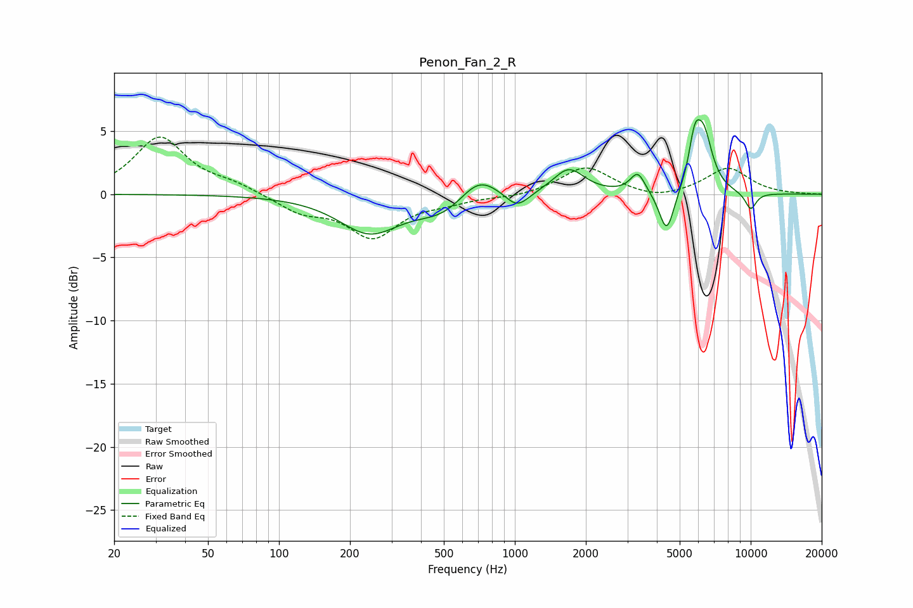

# Penon_Fan_2_R
See [usage instructions](https://github.com/jaakkopasanen/AutoEq#usage) for more options and info.

### Parametric EQs
Apply preamp of -6.0 dB when using parametric equalizer.

|   # | Type    |   Fc (Hz) |    Q |   Gain (dB) |
|-----|---------|-----------|------|-------------|
|   1 | Peaking |       242 | 1.1  |        -3   |
|   2 | Peaking |       497 | 1.27 |        -1.4 |
|   3 | Peaking |       702 | 1.73 |         1.9 |
|   4 | Peaking |      1022 | 2.84 |        -1.3 |
|   5 | Peaking |      1694 | 2.16 |         2   |
|   6 | Peaking |      3320 | 4.48 |         1.6 |
|   7 | Peaking |      4406 | 4.39 |        -3.5 |
|   8 | Peaking |      5778 | 5.91 |         2.9 |
|   9 | Peaking |      6305 | 3.65 |         4.6 |
|  10 | Peaking |     10000 | 5.01 |        -1.4 |

### Fixed Band EQs
When using fixed band (also called graphic) equalizer, apply preamp of **-4.6 dB** (if available) and set gains manually with these parameters.

|   # | Type    |   Fc (Hz) |    Q |   Gain (dB) |
|-----|---------|-----------|------|-------------|
|   1 | Peaking |        31 | 1.41 |         4.5 |
|   2 | Peaking |        62 | 1.41 |         0.7 |
|   3 | Peaking |       125 | 1.41 |        -1.3 |
|   4 | Peaking |       250 | 1.41 |        -3.3 |
|   5 | Peaking |       500 | 1.41 |        -0.5 |
|   6 | Peaking |      1000 | 1.41 |        -0.2 |
|   7 | Peaking |      2000 | 1.41 |         2.2 |
|   8 | Peaking |      4000 | 1.41 |        -0.5 |
|   9 | Peaking |      8000 | 1.41 |         2.1 |
|  10 | Peaking |     16000 | 1.41 |         0   |

### Graphs

