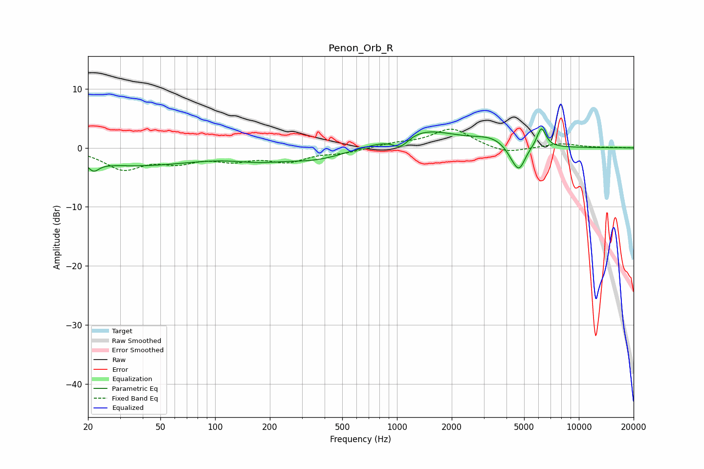

# Penon_Orb_R
See [usage instructions](https://github.com/jaakkopasanen/AutoEq#usage) for more options and info.

### Parametric EQs
Apply preamp of -3.3 dB when using parametric equalizer.

|   # | Type    |   Fc (Hz) |    Q |   Gain (dB) |
|-----|---------|-----------|------|-------------|
|   1 | Peaking |        21 | 4.94 |        -1.5 |
|   2 | Peaking |        36 | 0.4  |        -2.9 |
|   3 | Peaking |       173 | 1    |        -1.2 |
|   4 | Peaking |       359 | 0.79 |        -1.9 |
|   5 | Peaking |      1049 | 3.14 |        -2   |
|   6 | Peaking |      1367 | 0.76 |         3.1 |
|   7 | Peaking |      3339 | 1.44 |         1.3 |
|   8 | Peaking |      4321 | 3.37 |        -1.4 |
|   9 | Peaking |      4705 | 4.08 |        -3.6 |
|  10 | Peaking |      6225 | 5.6  |         3.4 |

### Fixed Band EQs
When using fixed band (also called graphic) equalizer, apply preamp of **-3.3 dB** (if available) and set gains manually with these parameters.

|   # | Type    |   Fc (Hz) |    Q |   Gain (dB) |
|-----|---------|-----------|------|-------------|
|   1 | Peaking |        31 | 1.41 |        -3.4 |
|   2 | Peaking |        62 | 1.41 |        -2   |
|   3 | Peaking |       125 | 1.41 |        -1.7 |
|   4 | Peaking |       250 | 1.41 |        -2.1 |
|   5 | Peaking |       500 | 1.41 |        -0.7 |
|   6 | Peaking |      1000 | 1.41 |         0.7 |
|   7 | Peaking |      2000 | 1.41 |         3.3 |
|   8 | Peaking |      4000 | 1.41 |        -1.1 |
|   9 | Peaking |      8000 | 1.41 |         0.7 |
|  10 | Peaking |     16000 | 1.41 |         0.1 |

### Graphs

