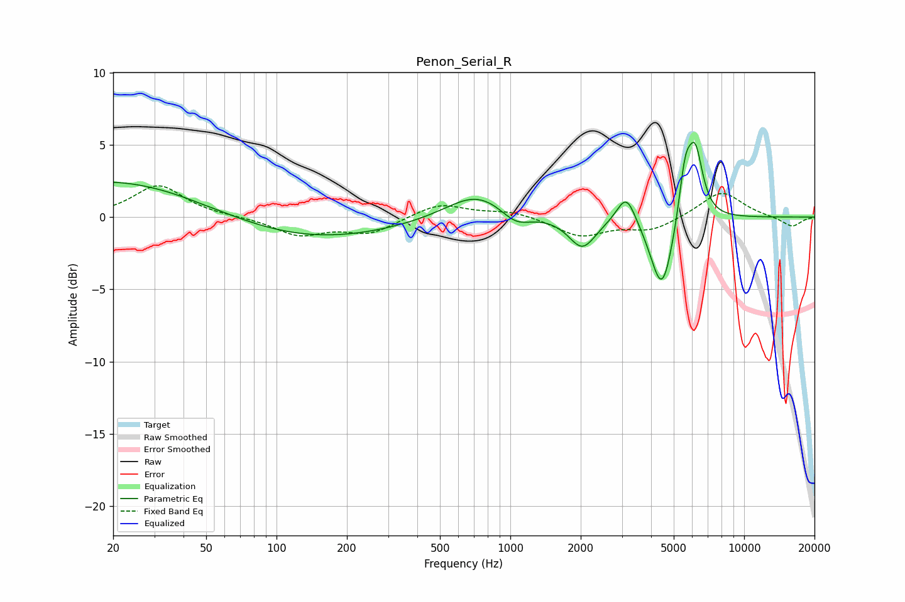

# Penon_Serial_R
See [usage instructions](https://github.com/jaakkopasanen/AutoEq#usage) for more options and info.

### Parametric EQs
Apply preamp of -5.3 dB when using parametric equalizer.

|   # | Type    |   Fc (Hz) |    Q |   Gain (dB) |
|-----|---------|-----------|------|-------------|
|   1 | Peaking |        20 | 0.37 |         2.6 |
|   2 | Peaking |        47 | 5.88 |        -0   |
|   3 | Peaking |       138 | 0.39 |        -1.6 |
|   4 | Peaking |       720 | 1.07 |         1.9 |
|   5 | Peaking |      1055 | 2.19 |        -1   |
|   6 | Peaking |      2031 | 2.44 |        -2.2 |
|   7 | Peaking |      3135 | 3.46 |         2.1 |
|   8 | Peaking |      4457 | 2.86 |        -5.4 |
|   9 | Peaking |      5593 | 5.17 |         3.5 |
|  10 | Peaking |      6185 | 4.22 |         4.6 |

### Fixed Band EQs
When using fixed band (also called graphic) equalizer, apply preamp of **-2.3 dB** (if available) and set gains manually with these parameters.

|   # | Type    |   Fc (Hz) |    Q |   Gain (dB) |
|-----|---------|-----------|------|-------------|
|   1 | Peaking |        31 | 1.41 |         2.2 |
|   2 | Peaking |        62 | 1.41 |         0   |
|   3 | Peaking |       125 | 1.41 |        -1.2 |
|   4 | Peaking |       250 | 1.41 |        -1.1 |
|   5 | Peaking |       500 | 1.41 |         1   |
|   6 | Peaking |      1000 | 1.41 |         0.4 |
|   7 | Peaking |      2000 | 1.41 |        -1.3 |
|   8 | Peaking |      4000 | 1.41 |        -0.9 |
|   9 | Peaking |      8000 | 1.41 |         1.8 |
|  10 | Peaking |     16000 | 1.41 |        -0.7 |

### Graphs

