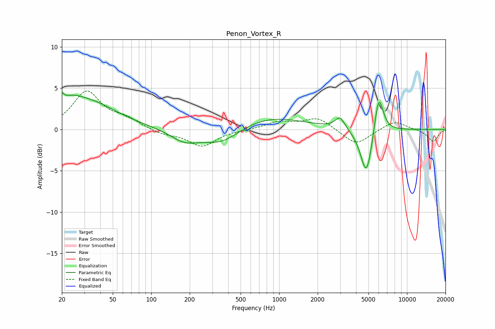

# Penon_Vortex_R
See [usage instructions](https://github.com/jaakkopasanen/AutoEq#usage) for more options and info.

### Parametric EQs
Apply preamp of -4.6 dB when using parametric equalizer.

|   # | Type    |   Fc (Hz) |    Q |   Gain (dB) |
|-----|---------|-----------|------|-------------|
|   1 | Peaking |        20 | 5.75 |         3.3 |
|   2 | Peaking |        20 | 6    |        -2.1 |
|   3 | Peaking |        24 | 1.86 |         0.9 |
|   4 | Peaking |        31 | 0.61 |         3.4 |
|   5 | Peaking |       183 | 1.29 |        -1.4 |
|   6 | Peaking |       354 | 0.96 |        -2   |
|   7 | Peaking |       821 | 0.52 |         1.6 |
|   8 | Peaking |      2992 | 3.63 |         1.5 |
|   9 | Peaking |      4823 | 2.99 |        -6   |
|  10 | Peaking |      6011 | 3.85 |         5   |

### Fixed Band EQs
When using fixed band (also called graphic) equalizer, apply preamp of **-4.8 dB** (if available) and set gains manually with these parameters.

|   # | Type    |   Fc (Hz) |    Q |   Gain (dB) |
|-----|---------|-----------|------|-------------|
|   1 | Peaking |        31 | 1.41 |         4.5 |
|   2 | Peaking |        62 | 1.41 |         1.1 |
|   3 | Peaking |       125 | 1.41 |        -0.6 |
|   4 | Peaking |       250 | 1.41 |        -2   |
|   5 | Peaking |       500 | 1.41 |        -0   |
|   6 | Peaking |      1000 | 1.41 |         0.9 |
|   7 | Peaking |      2000 | 1.41 |         1.4 |
|   8 | Peaking |      4000 | 1.41 |        -1.9 |
|   9 | Peaking |      8000 | 1.41 |         1.1 |
|  10 | Peaking |     16000 | 1.41 |        -1.5 |

### Graphs

