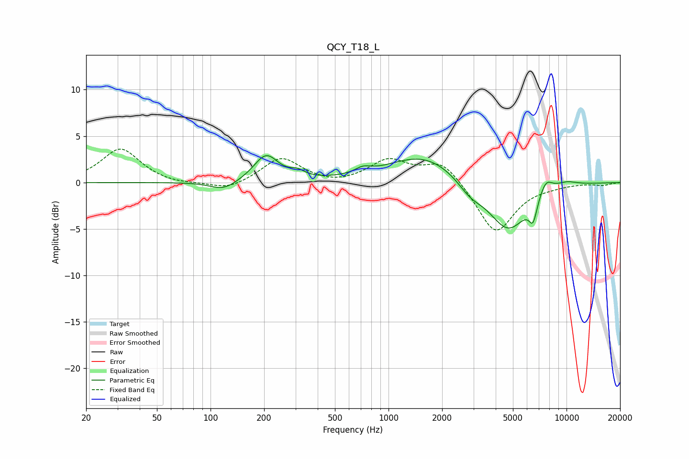

# QCY_T18_L
See [usage instructions](https://github.com/jaakkopasanen/AutoEq#usage) for more options and info.

### Parametric EQs
Apply preamp of -3.0 dB when using parametric equalizer.

|   # | Type    |   Fc (Hz) |    Q |   Gain (dB) |
|-----|---------|-----------|------|-------------|
|   1 | Peaking |       119 | 1.89 |        -1   |
|   2 | Peaking |       205 | 2.05 |         2.9 |
|   3 | Peaking |       307 | 3.44 |         0.6 |
|   4 | Peaking |       717 | 3.25 |         0.6 |
|   5 | Peaking |      1588 | 0.7  |         3   |
|   6 | Peaking |      2867 | 1.98 |        -1.4 |
|   7 | Peaking |      4702 | 1.23 |        -5.3 |
|   8 | Peaking |      6486 | 6    |        -2.2 |
|   9 | Peaking |      7656 | 3.58 |         1.6 |
|  10 | Peaking |      9907 | 1.86 |         0.6 |

### Fixed Band EQs
When using fixed band (also called graphic) equalizer, apply preamp of **-3.7 dB** (if available) and set gains manually with these parameters.

|   # | Type    |   Fc (Hz) |    Q |   Gain (dB) |
|-----|---------|-----------|------|-------------|
|   1 | Peaking |        31 | 1.41 |         3.7 |
|   2 | Peaking |        62 | 1.41 |        -0.3 |
|   3 | Peaking |       125 | 1.41 |        -0.9 |
|   4 | Peaking |       250 | 1.41 |         2.7 |
|   5 | Peaking |       500 | 1.41 |        -0.4 |
|   6 | Peaking |      1000 | 1.41 |         2.3 |
|   7 | Peaking |      2000 | 1.41 |         2.4 |
|   8 | Peaking |      4000 | 1.41 |        -5.6 |
|   9 | Peaking |      8000 | 1.41 |        -0.2 |
|  10 | Peaking |     16000 | 1.41 |        -0.3 |

### Graphs

