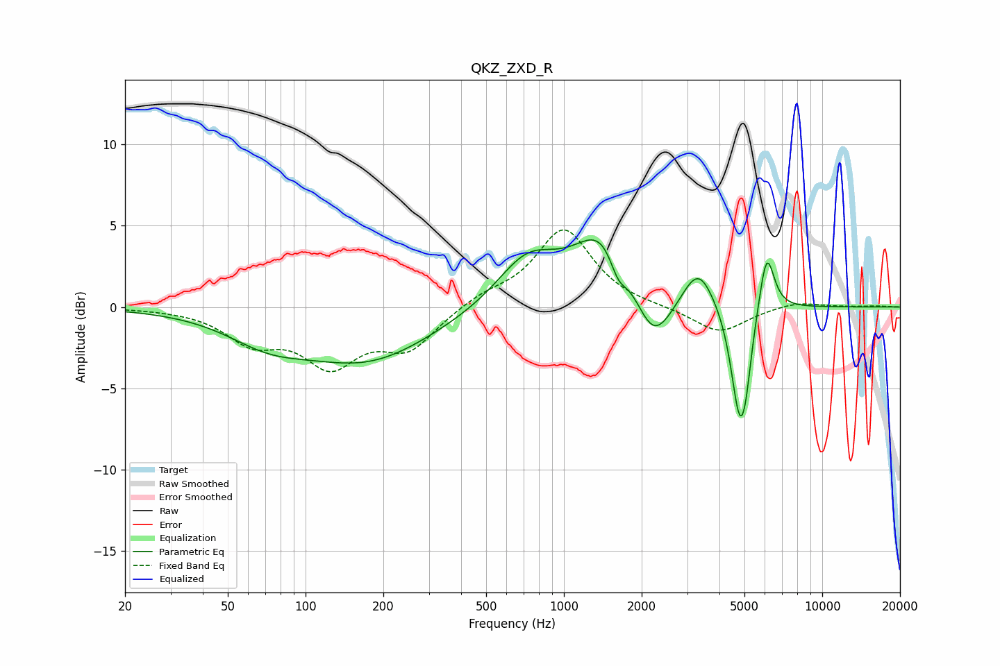

# QKZ_ZXD_R
See [usage instructions](https://github.com/jaakkopasanen/AutoEq#usage) for more options and info.

### Parametric EQs
Apply preamp of -4.2 dB when using parametric equalizer.

|   # | Type    |   Fc (Hz) |    Q |   Gain (dB) |
|-----|---------|-----------|------|-------------|
|   1 | Peaking |        71 | 0.89 |        -1.5 |
|   2 | Peaking |       174 | 0.56 |        -3.2 |
|   3 | Peaking |       722 | 1.19 |         2.9 |
|   4 | Peaking |      1448 | 1.23 |         4.7 |
|   5 | Peaking |      1620 | 4.04 |        -1.7 |
|   6 | Peaking |      2213 | 1.89 |        -3.6 |
|   7 | Peaking |      3315 | 2.32 |         2.6 |
|   8 | Peaking |      4781 | 4.05 |        -6.5 |
|   9 | Peaking |      5049 | 6    |        -1.9 |
|  10 | Peaking |      6093 | 4.73 |         3.9 |

### Fixed Band EQs
When using fixed band (also called graphic) equalizer, apply preamp of **-4.8 dB** (if available) and set gains manually with these parameters.

|   # | Type    |   Fc (Hz) |    Q |   Gain (dB) |
|-----|---------|-----------|------|-------------|
|   1 | Peaking |        31 | 1.41 |        -0   |
|   2 | Peaking |        62 | 1.41 |        -1.9 |
|   3 | Peaking |       125 | 1.41 |        -3.2 |
|   4 | Peaking |       250 | 1.41 |        -2.4 |
|   5 | Peaking |       500 | 1.41 |         0.7 |
|   6 | Peaking |      1000 | 1.41 |         4.8 |
|   7 | Peaking |      2000 | 1.41 |        -0   |
|   8 | Peaking |      4000 | 1.41 |        -1.6 |
|   9 | Peaking |      8000 | 1.41 |         0.4 |
|  10 | Peaking |     16000 | 1.41 |         0.1 |

### Graphs

