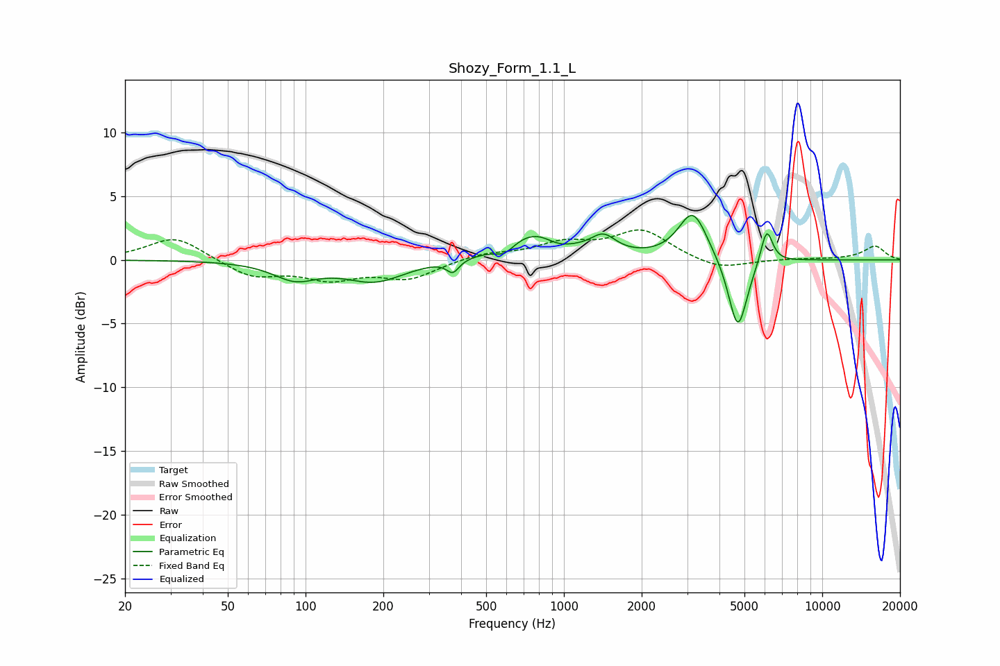

# Shozy_Form_1.1_L
See [usage instructions](https://github.com/jaakkopasanen/AutoEq#usage) for more options and info.

### Parametric EQs
Apply preamp of -3.6 dB when using parametric equalizer.

|   # | Type    |   Fc (Hz) |    Q |   Gain (dB) |
|-----|---------|-----------|------|-------------|
|   1 | Peaking |        91 | 1.68 |        -1.4 |
|   2 | Peaking |       186 | 1.21 |        -1.6 |
|   3 | Peaking |       372 | 5.98 |        -1   |
|   4 | Peaking |       590 | 3.76 |        -0.8 |
|   5 | Peaking |       780 | 1.23 |         2.3 |
|   6 | Peaking |       944 | 2.54 |        -0.7 |
|   7 | Peaking |      1421 | 2.94 |         1.4 |
|   8 | Peaking |      3157 | 2.54 |         3.8 |
|   9 | Peaking |      4713 | 3.81 |        -5.8 |
|  10 | Peaking |      6094 | 5.98 |         2.8 |

### Fixed Band EQs
When using fixed band (also called graphic) equalizer, apply preamp of **-2.4 dB** (if available) and set gains manually with these parameters.

|   # | Type    |   Fc (Hz) |    Q |   Gain (dB) |
|-----|---------|-----------|------|-------------|
|   1 | Peaking |        31 | 1.41 |         1.9 |
|   2 | Peaking |        62 | 1.41 |        -1.3 |
|   3 | Peaking |       125 | 1.41 |        -1.3 |
|   4 | Peaking |       250 | 1.41 |        -1.4 |
|   5 | Peaking |       500 | 1.41 |         0.5 |
|   6 | Peaking |      1000 | 1.41 |         1.2 |
|   7 | Peaking |      2000 | 1.41 |         2.3 |
|   8 | Peaking |      4000 | 1.41 |        -0.8 |
|   9 | Peaking |      8000 | 1.41 |         0.1 |
|  10 | Peaking |     16000 | 1.41 |         1.1 |

### Graphs

