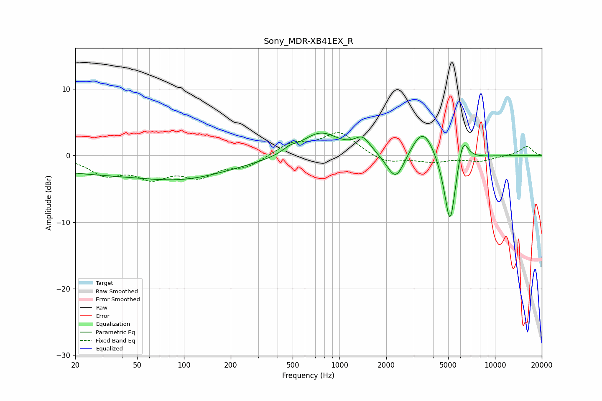

# Sony_MDR-XB41EX_R
See [usage instructions](https://github.com/jaakkopasanen/AutoEq#usage) for more options and info.

### Parametric EQs
Apply preamp of -3.5 dB when using parametric equalizer.

|   # | Type    |   Fc (Hz) |    Q |   Gain (dB) |
|-----|---------|-----------|------|-------------|
|   1 | Peaking |        43 | 0.18 |        -2.7 |
|   2 | Peaking |        96 | 0.76 |        -0.5 |
|   3 | Peaking |       106 | 0.46 |        -0.7 |
|   4 | Peaking |       479 | 3.17 |         0.7 |
|   5 | Peaking |       753 | 1.19 |         3.5 |
|   6 | Peaking |      1409 | 2.71 |         2.2 |
|   7 | Peaking |      2304 | 2.42 |        -4.4 |
|   8 | Peaking |      3451 | 1.83 |         4.7 |
|   9 | Peaking |      5145 | 3.53 |       -11.8 |
|  10 | Peaking |      6190 | 3.77 |         4.6 |

### Fixed Band EQs
When using fixed band (also called graphic) equalizer, apply preamp of **-3.5 dB** (if available) and set gains manually with these parameters.

|   # | Type    |   Fc (Hz) |    Q |   Gain (dB) |
|-----|---------|-----------|------|-------------|
|   1 | Peaking |        31 | 1.41 |        -2.6 |
|   2 | Peaking |        62 | 1.41 |        -2.9 |
|   3 | Peaking |       125 | 1.41 |        -2.7 |
|   4 | Peaking |       250 | 1.41 |        -1.6 |
|   5 | Peaking |       500 | 1.41 |         1.8 |
|   6 | Peaking |      1000 | 1.41 |         3.4 |
|   7 | Peaking |      2000 | 1.41 |        -1.2 |
|   8 | Peaking |      4000 | 1.41 |        -0.8 |
|   9 | Peaking |      8000 | 1.41 |        -0.8 |
|  10 | Peaking |     16000 | 1.41 |         1.4 |

### Graphs

