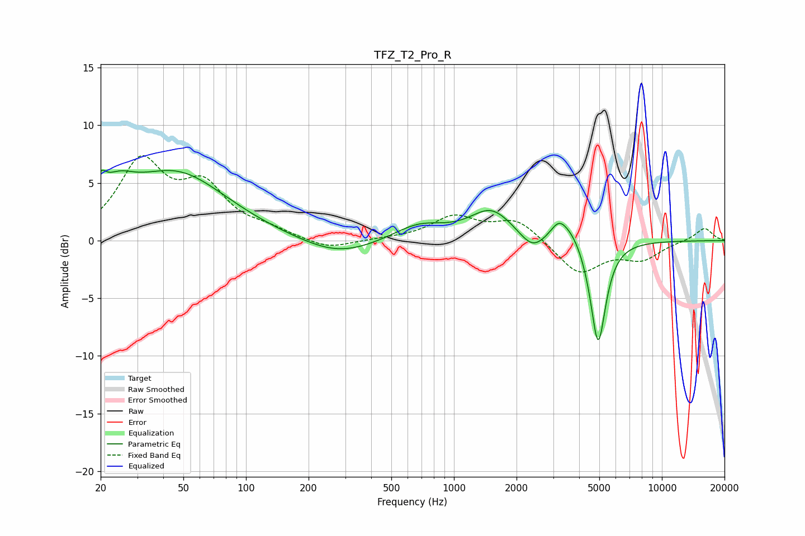

# TFZ_T2_Pro_R
See [usage instructions](https://github.com/jaakkopasanen/AutoEq#usage) for more options and info.

### Parametric EQs
Apply preamp of -6.2 dB when using parametric equalizer.

|   # | Type    |   Fc (Hz) |    Q |   Gain (dB) |
|-----|---------|-----------|------|-------------|
|   1 | Peaking |        20 | 5.67 |         1.7 |
|   2 | Peaking |        24 | 1.73 |         2.2 |
|   3 | Peaking |        46 | 0.58 |         5.8 |
|   4 | Peaking |       278 | 0.79 |        -1.5 |
|   5 | Peaking |       678 | 1.13 |         1.4 |
|   6 | Peaking |      1515 | 1.37 |         2.6 |
|   7 | Peaking |      2382 | 2.31 |        -1.4 |
|   8 | Peaking |      3207 | 3.25 |         1.7 |
|   9 | Peaking |      3739 | 2.7  |         1   |
|  10 | Peaking |      4935 | 3.79 |        -9.1 |

### Fixed Band EQs
When using fixed band (also called graphic) equalizer, apply preamp of **-7.5 dB** (if available) and set gains manually with these parameters.

|   # | Type    |   Fc (Hz) |    Q |   Gain (dB) |
|-----|---------|-----------|------|-------------|
|   1 | Peaking |        31 | 1.41 |         6.6 |
|   2 | Peaking |        62 | 1.41 |         4.2 |
|   3 | Peaking |       125 | 1.41 |         0.7 |
|   4 | Peaking |       250 | 1.41 |        -0.8 |
|   5 | Peaking |       500 | 1.41 |         0.1 |
|   6 | Peaking |      1000 | 1.41 |         2   |
|   7 | Peaking |      2000 | 1.41 |         1.8 |
|   8 | Peaking |      4000 | 1.41 |        -2.9 |
|   9 | Peaking |      8000 | 1.41 |        -1.5 |
|  10 | Peaking |     16000 | 1.41 |         1.1 |

### Graphs

