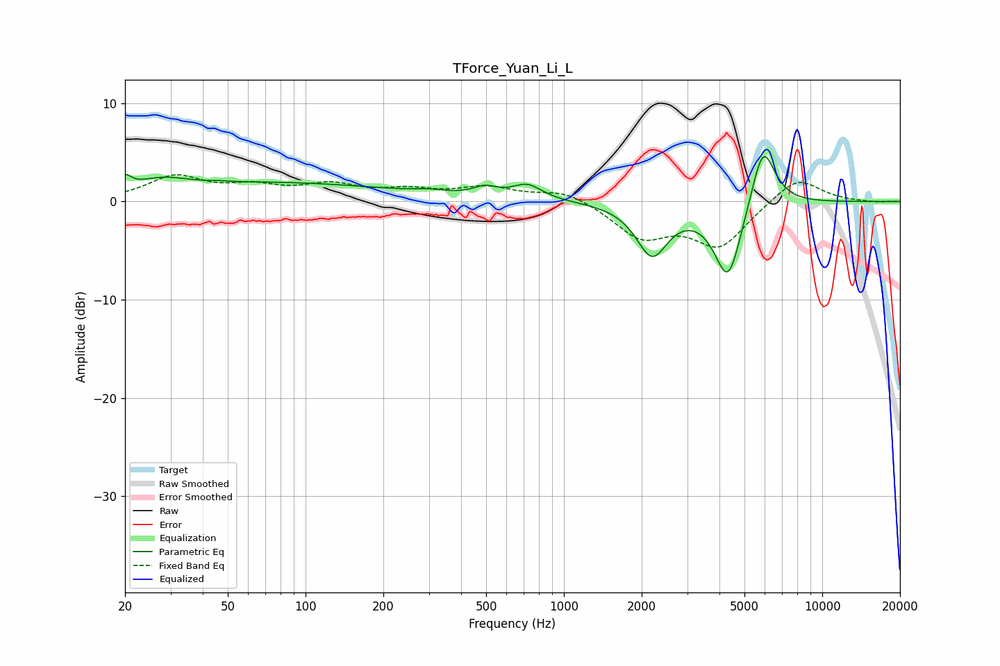

# TForce_Yuan_Li_L
See [usage instructions](https://github.com/jaakkopasanen/AutoEq#usage) for more options and info.

### Parametric EQs
Apply preamp of -4.7 dB when using parametric equalizer.

|   # | Type    |   Fc (Hz) |    Q |   Gain (dB) |
|-----|---------|-----------|------|-------------|
|   1 | Peaking |        20 | 6    |         1.2 |
|   2 | Peaking |        28 | 1.49 |         1   |
|   3 | Peaking |        46 | 5    |         0.1 |
|   4 | Peaking |        72 | 0.28 |         1.9 |
|   5 | Peaking |       303 | 2.24 |         0.3 |
|   6 | Peaking |       495 | 3    |         0.9 |
|   7 | Peaking |       722 | 2.43 |         1.5 |
|   8 | Peaking |      2194 | 2.32 |        -5.2 |
|   9 | Peaking |      4325 | 2.58 |        -8.1 |
|  10 | Peaking |      5894 | 2.9  |         6.7 |

### Fixed Band EQs
When using fixed band (also called graphic) equalizer, apply preamp of **-2.8 dB** (if available) and set gains manually with these parameters.

|   # | Type    |   Fc (Hz) |    Q |   Gain (dB) |
|-----|---------|-----------|------|-------------|
|   1 | Peaking |        31 | 1.41 |         2.4 |
|   2 | Peaking |        62 | 1.41 |         1.2 |
|   3 | Peaking |       125 | 1.41 |         1.5 |
|   4 | Peaking |       250 | 1.41 |         0.9 |
|   5 | Peaking |       500 | 1.41 |         1.3 |
|   6 | Peaking |      1000 | 1.41 |         1.2 |
|   7 | Peaking |      2000 | 1.41 |        -3.5 |
|   8 | Peaking |      4000 | 1.41 |        -4.4 |
|   9 | Peaking |      8000 | 1.41 |         2.6 |
|  10 | Peaking |     16000 | 1.41 |        -0.1 |

### Graphs

