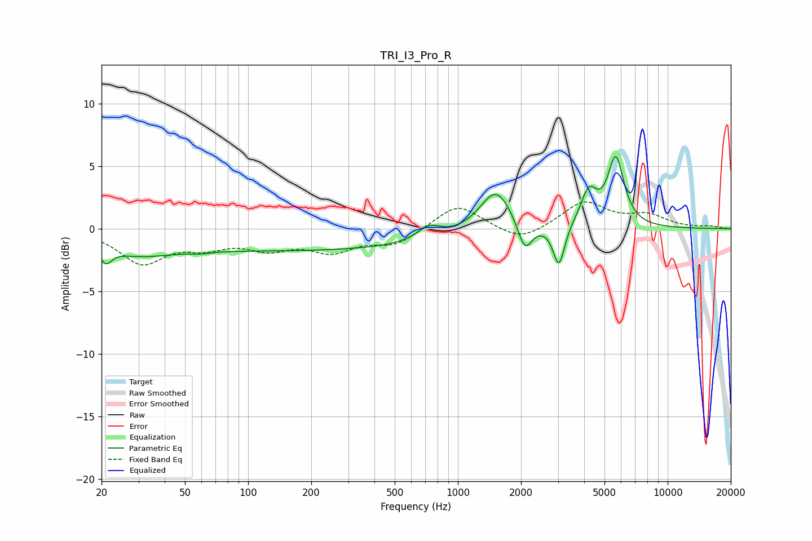

# TRI_I3_Pro_R
See [usage instructions](https://github.com/jaakkopasanen/AutoEq#usage) for more options and info.

### Parametric EQs
Apply preamp of -5.9 dB when using parametric equalizer.

|   # | Type    |   Fc (Hz) |    Q |   Gain (dB) |
|-----|---------|-----------|------|-------------|
|   1 | Peaking |        21 | 4.85 |        -1.3 |
|   2 | Peaking |        29 | 0.84 |        -1.3 |
|   3 | Peaking |        59 | 2.86 |        -0.1 |
|   4 | Peaking |       184 | 0.18 |        -1.7 |
|   5 | Peaking |       729 | 2.5  |         1.1 |
|   6 | Peaking |      1519 | 1.84 |         3.5 |
|   7 | Peaking |      2086 | 4.11 |        -2.4 |
|   8 | Peaking |      3030 | 5.21 |        -3.3 |
|   9 | Peaking |      4210 | 3.65 |         2.7 |
|  10 | Peaking |      5660 | 3.59 |         5.4 |

### Fixed Band EQs
When using fixed band (also called graphic) equalizer, apply preamp of **-2.2 dB** (if available) and set gains manually with these parameters.

|   # | Type    |   Fc (Hz) |    Q |   Gain (dB) |
|-----|---------|-----------|------|-------------|
|   1 | Peaking |        31 | 1.41 |        -2.6 |
|   2 | Peaking |        62 | 1.41 |        -1.1 |
|   3 | Peaking |       125 | 1.41 |        -1.3 |
|   4 | Peaking |       250 | 1.41 |        -1.6 |
|   5 | Peaking |       500 | 1.41 |        -1.2 |
|   6 | Peaking |      1000 | 1.41 |         2   |
|   7 | Peaking |      2000 | 1.41 |        -1.1 |
|   8 | Peaking |      4000 | 1.41 |         2.1 |
|   9 | Peaking |      8000 | 1.41 |         1   |
|  10 | Peaking |     16000 | 1.41 |         0.2 |

### Graphs

