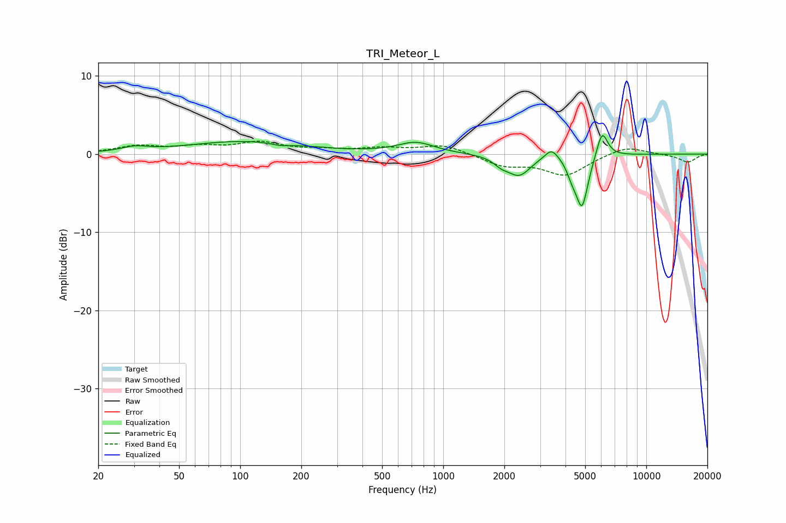

# TRI_Meteor_L
See [usage instructions](https://github.com/jaakkopasanen/AutoEq#usage) for more options and info.

### Parametric EQs
Apply preamp of -2.5 dB when using parametric equalizer.

|   # | Type    |   Fc (Hz) |    Q |   Gain (dB) |
|-----|---------|-----------|------|-------------|
|   1 | Peaking |        30 | 2.24 |         0.6 |
|   2 | Peaking |       106 | 0.49 |         1.6 |
|   3 | Peaking |       159 | 2.91 |        -0.3 |
|   4 | Peaking |       733 | 1.56 |         1.4 |
|   5 | Peaking |      1928 | 3.88 |        -0.8 |
|   6 | Peaking |      2363 | 2.49 |        -2.6 |
|   7 | Peaking |      3420 | 4.17 |         1.5 |
|   8 | Peaking |      4297 | 5.98 |        -1.3 |
|   9 | Peaking |      4822 | 4.54 |        -6.7 |
|  10 | Peaking |      6060 | 4.99 |         3.5 |

### Fixed Band EQs
When using fixed band (also called graphic) equalizer, apply preamp of **-1.7 dB** (if available) and set gains manually with these parameters.

|   # | Type    |   Fc (Hz) |    Q |   Gain (dB) |
|-----|---------|-----------|------|-------------|
|   1 | Peaking |        31 | 1.41 |         0.9 |
|   2 | Peaking |        62 | 1.41 |         0.8 |
|   3 | Peaking |       125 | 1.41 |         1.4 |
|   4 | Peaking |       250 | 1.41 |         0.4 |
|   5 | Peaking |       500 | 1.41 |         0.7 |
|   6 | Peaking |      1000 | 1.41 |         1.2 |
|   7 | Peaking |      2000 | 1.41 |        -1.4 |
|   8 | Peaking |      4000 | 1.41 |        -2.6 |
|   9 | Peaking |      8000 | 1.41 |         1.1 |
|  10 | Peaking |     16000 | 1.41 |        -1   |

### Graphs

