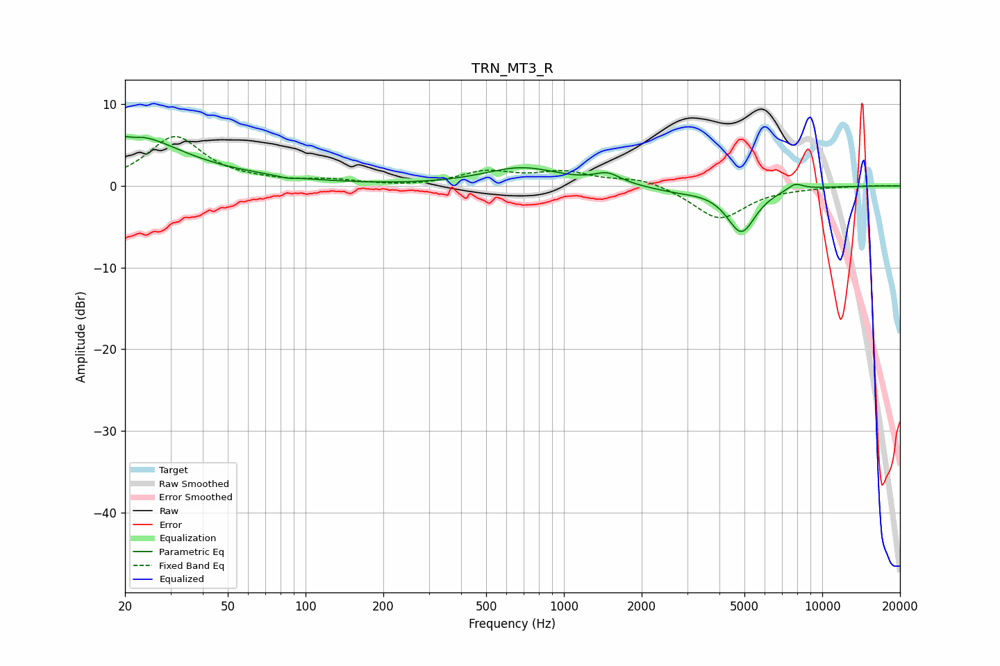

# TRN_MT3_R
See [usage instructions](https://github.com/jaakkopasanen/AutoEq#usage) for more options and info.

### Parametric EQs
Apply preamp of -6.1 dB when using parametric equalizer.

|   # | Type    |   Fc (Hz) |    Q |   Gain (dB) |
|-----|---------|-----------|------|-------------|
|   1 | Peaking |        21 | 0.78 |         5.9 |
|   2 | Peaking |        21 | 5.96 |         3.2 |
|   3 | Peaking |        21 | 5.96 |        -3.4 |
|   4 | Peaking |        56 | 0.52 |         0.6 |
|   5 | Peaking |        85 | 4.58 |        -0.2 |
|   6 | Peaking |       687 | 0.96 |         2.2 |
|   7 | Peaking |      1475 | 2.78 |         1.2 |
|   8 | Peaking |      2720 | 1.33 |        -0.6 |
|   9 | Peaking |      4863 | 2.47 |        -5.5 |
|  10 | Peaking |      7864 | 4.36 |         0.8 |

### Fixed Band EQs
When using fixed band (also called graphic) equalizer, apply preamp of **-6.1 dB** (if available) and set gains manually with these parameters.

|   # | Type    |   Fc (Hz) |    Q |   Gain (dB) |
|-----|---------|-----------|------|-------------|
|   1 | Peaking |        31 | 1.41 |         6   |
|   2 | Peaking |        62 | 1.41 |         0.3 |
|   3 | Peaking |       125 | 1.41 |         0.6 |
|   4 | Peaking |       250 | 1.41 |        -0.2 |
|   5 | Peaking |       500 | 1.41 |         1.6 |
|   6 | Peaking |      1000 | 1.41 |         1.5 |
|   7 | Peaking |      2000 | 1.41 |         1   |
|   8 | Peaking |      4000 | 1.41 |        -4.1 |
|   9 | Peaking |      8000 | 1.41 |        -0.1 |
|  10 | Peaking |     16000 | 1.41 |         0.1 |

### Graphs

