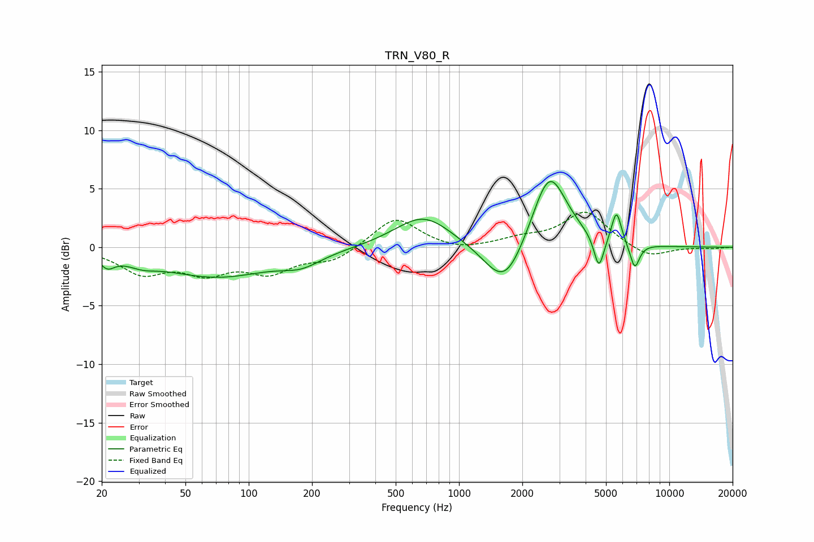

# TRN_V80_R
See [usage instructions](https://github.com/jaakkopasanen/AutoEq#usage) for more options and info.

### Parametric EQs
Apply preamp of -5.7 dB when using parametric equalizer.

|   # | Type    |   Fc (Hz) |    Q |   Gain (dB) |
|-----|---------|-----------|------|-------------|
|   1 | Peaking |        21 | 4.13 |        -1   |
|   2 | Peaking |        31 | 1.99 |        -0.6 |
|   3 | Peaking |        70 | 0.54 |        -2.5 |
|   4 | Peaking |       178 | 1.49 |        -1   |
|   5 | Peaking |       678 | 1.05 |         2.8 |
|   6 | Peaking |      1652 | 1.48 |        -4.2 |
|   7 | Peaking |      2686 | 1.68 |         6.8 |
|   8 | Peaking |      4626 | 5.94 |        -2.9 |
|   9 | Peaking |      5609 | 6    |         2.8 |
|  10 | Peaking |      6849 | 5.94 |        -2.2 |

### Fixed Band EQs
When using fixed band (also called graphic) equalizer, apply preamp of **-3.1 dB** (if available) and set gains manually with these parameters.

|   # | Type    |   Fc (Hz) |    Q |   Gain (dB) |
|-----|---------|-----------|------|-------------|
|   1 | Peaking |        31 | 1.41 |        -2.1 |
|   2 | Peaking |        62 | 1.41 |        -1.9 |
|   3 | Peaking |       125 | 1.41 |        -1.9 |
|   4 | Peaking |       250 | 1.41 |        -1.1 |
|   5 | Peaking |       500 | 1.41 |         2.6 |
|   6 | Peaking |      1000 | 1.41 |        -0.4 |
|   7 | Peaking |      2000 | 1.41 |         0.6 |
|   8 | Peaking |      4000 | 1.41 |         3   |
|   9 | Peaking |      8000 | 1.41 |        -1   |
|  10 | Peaking |     16000 | 1.41 |        -0.1 |

### Graphs

