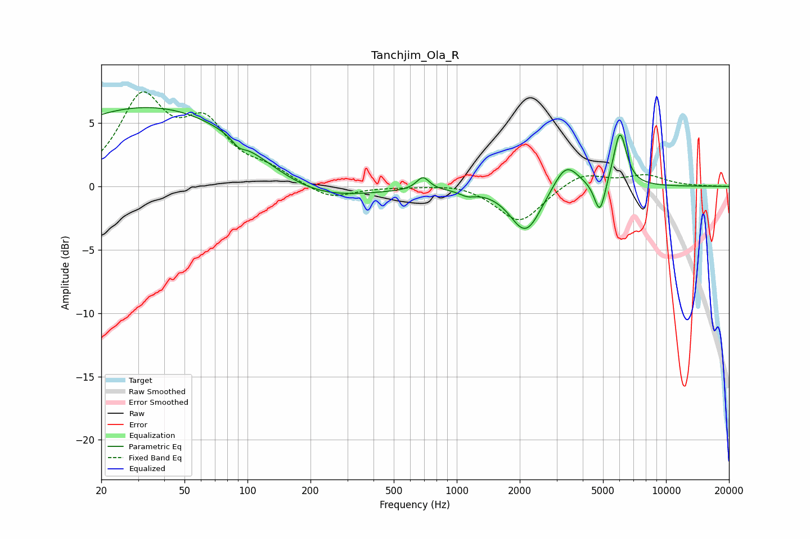

# Tanchjim_Ola_R
See [usage instructions](https://github.com/jaakkopasanen/AutoEq#usage) for more options and info.

### Parametric EQs
Apply preamp of -6.3 dB when using parametric equalizer.

|   # | Type    |   Fc (Hz) |    Q |   Gain (dB) |
|-----|---------|-----------|------|-------------|
|   1 | Peaking |        36 | 0.27 |         6.4 |
|   2 | Peaking |        91 | 4.65 |        -0.6 |
|   3 | Peaking |       190 | 0.56 |        -2.2 |
|   4 | Peaking |       689 | 4.65 |         1   |
|   5 | Peaking |      1123 | 3.81 |        -0.4 |
|   6 | Peaking |      2010 | 2.18 |        -0.7 |
|   7 | Peaking |      2171 | 1.94 |        -3   |
|   8 | Peaking |      3325 | 2.33 |         2.2 |
|   9 | Peaking |      4828 | 5.39 |        -2.6 |
|  10 | Peaking |      6025 | 4.43 |         4.3 |

### Fixed Band EQs
When using fixed band (also called graphic) equalizer, apply preamp of **-7.6 dB** (if available) and set gains manually with these parameters.

|   # | Type    |   Fc (Hz) |    Q |   Gain (dB) |
|-----|---------|-----------|------|-------------|
|   1 | Peaking |        31 | 1.41 |         6.6 |
|   2 | Peaking |        62 | 1.41 |         4.3 |
|   3 | Peaking |       125 | 1.41 |         1   |
|   4 | Peaking |       250 | 1.41 |        -1.1 |
|   5 | Peaking |       500 | 1.41 |        -0   |
|   6 | Peaking |      1000 | 1.41 |         0.3 |
|   7 | Peaking |      2000 | 1.41 |        -2.9 |
|   8 | Peaking |      4000 | 1.41 |         1.1 |
|   9 | Peaking |      8000 | 1.41 |         0.8 |
|  10 | Peaking |     16000 | 1.41 |        -0   |

### Graphs

