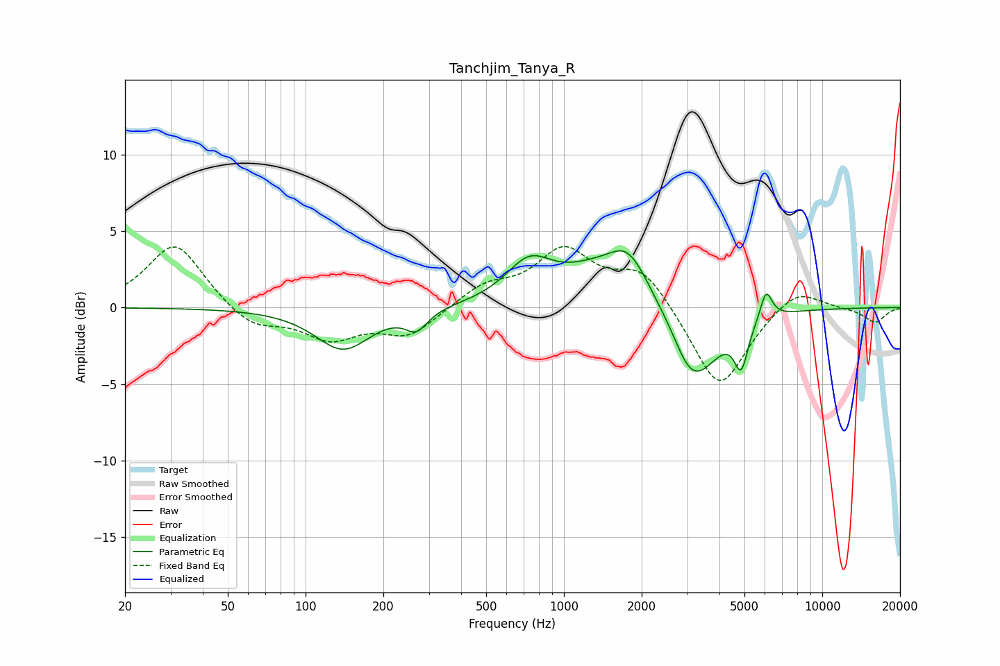

# Tanchjim_Tanya_R
See [usage instructions](https://github.com/jaakkopasanen/AutoEq#usage) for more options and info.

### Parametric EQs
Apply preamp of -3.8 dB when using parametric equalizer.

|   # | Type    |   Fc (Hz) |    Q |   Gain (dB) |
|-----|---------|-----------|------|-------------|
|   1 | Peaking |       140 | 1.32 |        -2.7 |
|   2 | Peaking |       269 | 3.35 |        -1.2 |
|   3 | Peaking |       733 | 1.6  |         2.5 |
|   4 | Peaking |      1505 | 1.95 |        -0.6 |
|   5 | Peaking |      1643 | 0.88 |         3.9 |
|   6 | Peaking |      1758 | 2.05 |         1.4 |
|   7 | Peaking |      2609 | 2.92 |         0.5 |
|   8 | Peaking |      3122 | 1.38 |        -5.9 |
|   9 | Peaking |      4858 | 5.35 |        -2.8 |
|  10 | Peaking |      6067 | 5.98 |         1.9 |

### Fixed Band EQs
When using fixed band (also called graphic) equalizer, apply preamp of **-4.1 dB** (if available) and set gains manually with these parameters.

|   # | Type    |   Fc (Hz) |    Q |   Gain (dB) |
|-----|---------|-----------|------|-------------|
|   1 | Peaking |        31 | 1.41 |         4.3 |
|   2 | Peaking |        62 | 1.41 |        -1.4 |
|   3 | Peaking |       125 | 1.41 |        -1.9 |
|   4 | Peaking |       250 | 1.41 |        -1.8 |
|   5 | Peaking |       500 | 1.41 |         1.3 |
|   6 | Peaking |      1000 | 1.41 |         3.5 |
|   7 | Peaking |      2000 | 1.41 |         2.5 |
|   8 | Peaking |      4000 | 1.41 |        -5.5 |
|   9 | Peaking |      8000 | 1.41 |         1.4 |
|  10 | Peaking |     16000 | 1.41 |        -1   |

### Graphs

