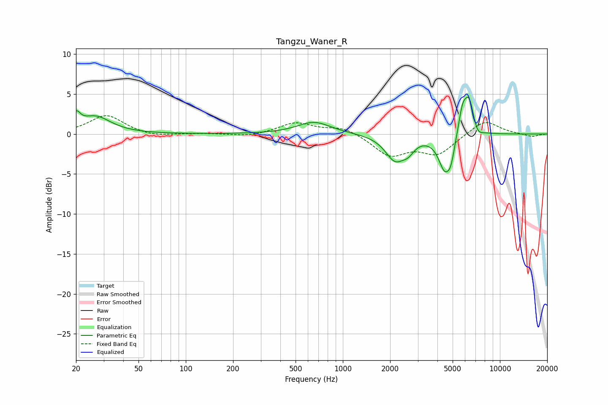

# Tangzu_Waner_R
See [usage instructions](https://github.com/jaakkopasanen/AutoEq#usage) for more options and info.

### Parametric EQs
Apply preamp of -4.7 dB when using parametric equalizer.

|   # | Type    |   Fc (Hz) |    Q |   Gain (dB) |
|-----|---------|-----------|------|-------------|
|   1 | Peaking |        20 | 5.64 |         1.7 |
|   2 | Peaking |        27 | 1.46 |         2.1 |
|   3 | Peaking |       656 | 1.35 |         1.5 |
|   4 | Peaking |      2150 | 2.27 |        -3.1 |
|   5 | Peaking |      2609 | 3.68 |        -1.1 |
|   6 | Peaking |      4460 | 3.42 |        -4.2 |
|   7 | Peaking |      4880 | 6    |        -1.9 |
|   8 | Peaking |      5769 | 5.42 |         2.9 |
|   9 | Peaking |      6363 | 4.34 |         4.4 |
|  10 | Peaking |      7188 | 4.63 |        -1   |

### Fixed Band EQs
When using fixed band (also called graphic) equalizer, apply preamp of **-2.4 dB** (if available) and set gains manually with these parameters.

|   # | Type    |   Fc (Hz) |    Q |   Gain (dB) |
|-----|---------|-----------|------|-------------|
|   1 | Peaking |        31 | 1.41 |         2.4 |
|   2 | Peaking |        62 | 1.41 |        -0.4 |
|   3 | Peaking |       125 | 1.41 |         0.1 |
|   4 | Peaking |       250 | 1.41 |        -0.3 |
|   5 | Peaking |       500 | 1.41 |         1.4 |
|   6 | Peaking |      1000 | 1.41 |         0.9 |
|   7 | Peaking |      2000 | 1.41 |        -2.6 |
|   8 | Peaking |      4000 | 1.41 |        -2.4 |
|   9 | Peaking |      8000 | 1.41 |         1.8 |
|  10 | Peaking |     16000 | 1.41 |        -0.4 |

### Graphs

