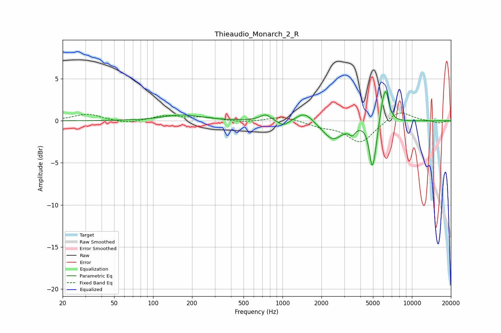

# Thieaudio_Monarch_2_R
See [usage instructions](https://github.com/jaakkopasanen/AutoEq#usage) for more options and info.

### Parametric EQs
Apply preamp of -3.6 dB when using parametric equalizer.

|   # | Type    |   Fc (Hz) |    Q |   Gain (dB) |
|-----|---------|-----------|------|-------------|
|   1 | Peaking |       168 | 0.98 |         0.7 |
|   2 | Peaking |       739 | 3.37 |         0.8 |
|   3 | Peaking |      1013 | 3.27 |        -0.7 |
|   4 | Peaking |      1484 | 2.25 |         1.2 |
|   5 | Peaking |      2442 | 1.82 |        -2.2 |
|   6 | Peaking |      3457 | 6    |        -0.9 |
|   7 | Peaking |      4928 | 6    |        -4.8 |
|   8 | Peaking |      5221 | 6    |        -1.3 |
|   9 | Peaking |      5896 | 5.99 |         1.3 |
|  10 | Peaking |      6278 | 5.57 |         3.5 |

### Fixed Band EQs
When using fixed band (also called graphic) equalizer, apply preamp of **-1.0 dB** (if available) and set gains manually with these parameters.

|   # | Type    |   Fc (Hz) |    Q |   Gain (dB) |
|-----|---------|-----------|------|-------------|
|   1 | Peaking |        31 | 1.41 |         0.8 |
|   2 | Peaking |        62 | 1.41 |        -0.4 |
|   3 | Peaking |       125 | 1.41 |         0.6 |
|   4 | Peaking |       250 | 1.41 |         0.4 |
|   5 | Peaking |       500 | 1.41 |        -0.2 |
|   6 | Peaking |      1000 | 1.41 |         0.6 |
|   7 | Peaking |      2000 | 1.41 |        -0.6 |
|   8 | Peaking |      4000 | 1.41 |        -2.6 |
|   9 | Peaking |      8000 | 1.41 |         1.3 |
|  10 | Peaking |     16000 | 1.41 |        -0.3 |

### Graphs

