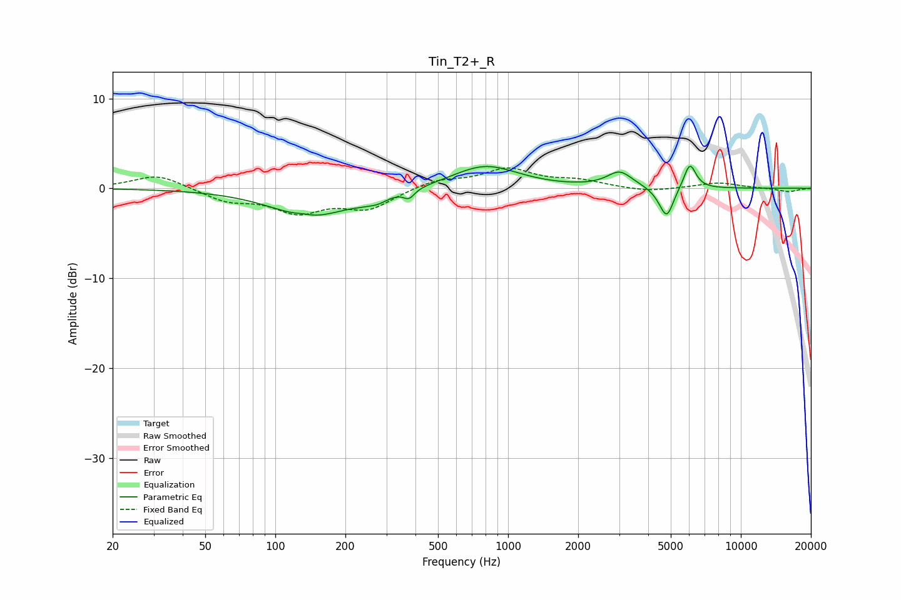

# Tin_T2+_R
See [usage instructions](https://github.com/jaakkopasanen/AutoEq#usage) for more options and info.

### Parametric EQs
Apply preamp of -2.5 dB when using parametric equalizer.

|   # | Type    |   Fc (Hz) |    Q |   Gain (dB) |
|-----|---------|-----------|------|-------------|
|   1 | Peaking |       132 | 4.89 |         0.2 |
|   2 | Peaking |       143 | 0.82 |        -3.1 |
|   3 | Peaking |       241 | 2.74 |        -0.3 |
|   4 | Peaking |       277 | 3.43 |        -0.5 |
|   5 | Peaking |       375 | 6    |        -1   |
|   6 | Peaking |       797 | 1    |         2.6 |
|   7 | Peaking |      3017 | 2.63 |         1.7 |
|   8 | Peaking |      4534 | 3.82 |        -0.6 |
|   9 | Peaking |      4818 | 4.93 |        -3   |
|  10 | Peaking |      6040 | 5.33 |         2.8 |

### Fixed Band EQs
When using fixed band (also called graphic) equalizer, apply preamp of **-2.4 dB** (if available) and set gains manually with these parameters.

|   # | Type    |   Fc (Hz) |    Q |   Gain (dB) |
|-----|---------|-----------|------|-------------|
|   1 | Peaking |        31 | 1.41 |         1.6 |
|   2 | Peaking |        62 | 1.41 |        -1.3 |
|   3 | Peaking |       125 | 1.41 |        -2.4 |
|   4 | Peaking |       250 | 1.41 |        -2.2 |
|   5 | Peaking |       500 | 1.41 |         0.9 |
|   6 | Peaking |      1000 | 1.41 |         2.1 |
|   7 | Peaking |      2000 | 1.41 |         0.8 |
|   8 | Peaking |      4000 | 1.41 |        -0.4 |
|   9 | Peaking |      8000 | 1.41 |         0.6 |
|  10 | Peaking |     16000 | 1.41 |        -0.4 |

### Graphs

